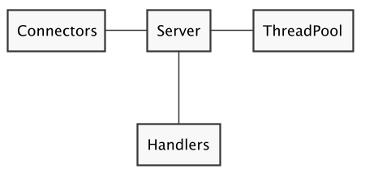
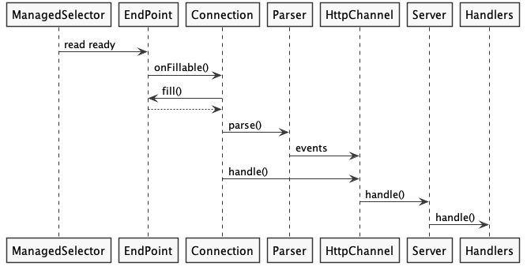
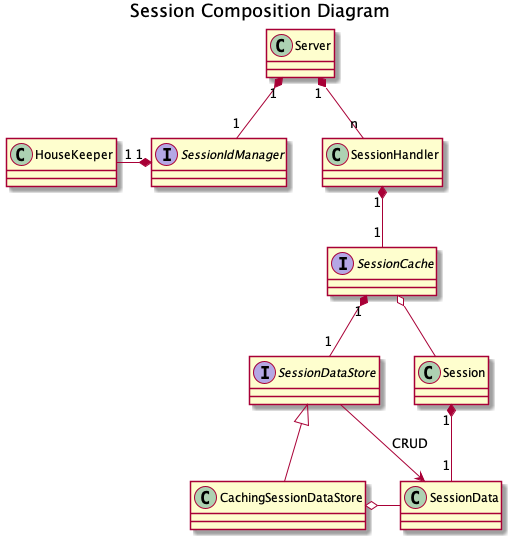
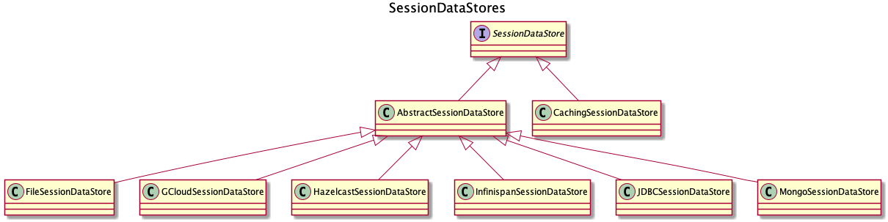

# Server Libraries

Eclipse Jetty Projectは、サーバーサイドのライブラリを提供しています。

提供する機能

- HTTP/1.0, HTTP/1.1, HTTP/2, クリアテキスト, 暗号化
- 低レベルのHTTP/2サポート
- WebSocket

---

- 1. HTTP Server Libraries
  - 1.1 Server Request Processing / サーバリクエスト処理
    - 1.1.1 HttpChannel Events
- 2. Server Connectors
  - 2.1 Configuring Protocols / プロトコルの設定
    - 2.1.1 Configuring Clear-Text HTTP/1.1 / 平文 HTTP/1.1 の設定
    - 2.1.2 Configuring Encrypted HTTP/1.1 (https) / 暗号化された HTTP/1.1 (https) の設定
    - 2.1.3 Configuring Jetty behind a Load Balancer / ロードバランサーの背後にあるJettyの設定
    - 2.1.4 Configuring Clear-Text HTTP/2 / 平文 HTTP/2 の設定
    - 2.1.5 Configuring Encrypted HTTP/2 / 暗号化されたHTTP/2の設定
- 3. Server Handlers
  - 3.1 Using Provided Handlers / 提供されているHandler
  - 3.2 Custom and Utility Handlers / カスタムHandlerとユーティリティHandler
    - 3.2.1 ContextHandler
    - 3.2.2 ContextHandlerCollection
    - 3.2.3 ResourceHandler — Static Content
    - 3.2.4 GzipHandler
    - 3.2.5 RewriteHandler
    - 3.2.6 StatisticsHandler
    - 3.2.7 SecuredRedirectHandler — Redirect from HTTP to HTTPS
    - 3.2.8 DefaultHandler
  - 3.3 Servlet API Handlers
    - 3.3.1 ServletContextHandler
    - 3.3.2 WebAppContext
    - 3.3.3 DefaultServlet — Static Content for Servlets
  - 3.4 Implementing Handler / ハンドラの実装
    - 3.4.1 Hello World Handler
    - 3.4.2 Filtering Handler
- 4. Writing HTTP Server Applications / HTTPサーバアプリケーションの記述
  - 4.1 Sending 1xx Responses / 1xxのレスポンスを送信する
    - 4.1.1 100 Continue
    - 4.2.2 102 Processing
- 5. HTTP/2 Server Library
  - 5.1 Introduction / はじめに
    - 5.1.2 HTTP/2 Flow Control / HTTP/2 フロー制御
  - 5.2 Server Setup / サーバーの設定
  - 5.3 Receiving a Request / リクエスト受信
  - 5.4 Sending a Response / レスポンスの送信
  - 5.5 Resetting a Request / リクエストのリセット
  - 5.6 HTTP/2 Push of Resources / HTTP/2 リソースのプッシュ
- 6. Session Management / セッション管理
  - 6.1 Session Architecture / セッションアーキテクチャ
  - 6.2 The SessionIdManager
    - 6.2.1 The DefaultSessionIdManager
    - 6.2.2 Implementing a Custom SessionIdManager / カスタム SessionIdManager の実装
    - 6.2.3 The HouseKeeper
  - 6.3 The SessionHandler
    - 6.3.1 Configuration / 設定
    - 6.3.2 Statistics / 統計
  - 6.4 The SessionCache
    - 6.4.1 The DefaultSessionCache
    - 6.4.2 The NullSessionCache
    - 6.4.3 Implementing a Custom SessionCache / カスタム SessionCache の実装
    - 6.4.5 Heterogenous Caching
  - 6.5 The SessionDataStore
    - 6.5.1 The FileSessionDataStore
    - 6.5.2 The JDBCSessionDataStore
    - 6.5.3 The MongoSessionDataStore
    - 6.5.4 The CachingSessionDataStore
- 7. WebSocket Server Libraries
- 8. Server Libraries I/O Architecture
  - 8.1 Creating Connections with ConnectionFactory / ConnectionFactoryでの接続の作成
  - 8.2 Wrapping a ConnectionFactory / ConnectionFactoryのラッピング
  - 8.3 Choosing ConnectionFactory via Bytes Detection / バイト検出によるConnectionFactoryの選択
  - 8.4 Writing a Custom ConnectionFactory / カスタムConnectionFactoryを書く

---

## 1. HTTP Server Libraries

Eclipse Jettyサーバーライブラリを使用すると、Jetty独自のAPIや標準のServlet APIを使用して、Webアプリケーションのコンポーネント(部品)を書くことができます。

`Server`インスタンスは、`Connector`のコレクションと、`Handler`のコレクションをリンクする中心的なコンポーネントです。`ThreadPool`で管理しているスレッドが作業を行います。



`Connector`は、クライアントからの接続を受け入れるコンポーネントです。

Jettyサーバは、`Handler`インスタンスを使用して、受信したリクエストを処理し、最終的にレスポンスを生成することで、HTTPプロトコルを解釈します。

最もシンプルなHTTP/1.1のサーバー実装方法は以下です。

サンプルコード：com.example.chapter1

```java
// ThreadPoolを作成して設定します。
QueuedThreadPool threadPool = new QueuedThreadPool();
threadPool.setName("server");

// サーバーインスタンスを作成します。
Server server = new Server(threadPool);

// ServerConnectorを作成して、クライアントからの接続を受け入れます。
Connector connector = new ServerConnector(server);

// サーバーにコネクタを追加します。
server.addConnector(connector);

// 単純なハンドラーを設定して、リクエスト/レスポンスを処理します。
server.setHandler(new AbstractHandler() {
    @Override
    public void handle(String target, Request jettyRequest, HttpServletRequest request, HttpServletResponse response) {
        // 他のハンドラーによって処理されないように、リクエストを処理済みとしてマークします。
        jettyRequest.setHandled(true);
    }
});

// サーバーを起動して、クライアントからの接続の受け入れを開始します。
server.start();
```

---

### 1.1 Server Request Processing / サーバリクエスト処理

JettyのHTTPリクエスト処理の概要を示す図です。



最初に、Jetty I/Oレイヤーは、ソケットが読み込むデータを持っていることを示すイベントを発行します。このイベントは`AbstractConnection.onFillable()`の呼び出しに変換されます。`AbstractConnection.onFillable()`が呼び出されると、`Connection`は最初に`EndPoint`から`ByteBuffer`に読み込んで、プロトコル固有の`Parser`を呼び出して`ByteBuffer`のバイトを解析します。

`Parser`は、プロトコル固有の`events`を発行します。`Parser`の`events`は、「リクエスト開始」、「リクエストヘッダ」、「リクエストコンテンツチャンク」などのプロトコルに依存しないイベントに変換し、これらのイベントは `HttpChannel`へのメソッド呼び出しに変換されます。

HTTPリクエストが到着すると、`Connection`は、最終的にサーバアプリケーションコードを呼び出すハンドラチェーンを呼び出す`HttpChannel.handle()`を呼び出します。

---

#### 1.1.1 HttpChannel Events

HTTPリクエストを処理する中心的なコンポーネントは`HttpChannel`です。HTTPリクエスト/レスポンスと `HttpChannel`の間には、1対1の関係があります。

`HttpChannel`によるHTTPリクエスト/レスポンスの処理の進行状況を知りたい場合があるかもしれません。

`HttpChannel`は、HTTPリクエスト/レスポンス処理の進行状況を`HttpChannel.Listeners`に通知します。用意されているイベントは以下です。

- `requestBegin`
- `beforeDispatch`
- `dispatchFailure`
- `afterDispatch`
- `requestContent`
- `requestContentEnd`
- `requestTrailers`
- `requestEnd`
- `responseBegin`
- `responseCommit`
- `responseContent`
- `responseFailure`
- `responseEnd`
- `complete`

サーバーアプリケーションは、`HttpChannel.Listener`を`beans`として`Connector`に追加することで登録できます。

サンプルコード：com.example.chapter1.section1.item1

```java
public class TimingHttpChannelListener implements HttpChannel.Listener {

    private final ConcurrentMap<Request, Long> times = new ConcurrentHashMap<>();

    @Override
    public void onRequestBegin(Request request) {
        times.put(request, System.nanoTime());
    }

    @Override
    public void onComplete(Request request) {
        long begin = times.remove(request);
        long elapsed = System.nanoTime() - begin;
        System.getLogger("timing").log(INFO, "Request {0} took {1} ns", request, elapsed);
    }

}
```

```java
Server server = new Server();

Connector connector = new ServerConnector(server);
server.addConnector(connector);

// HttpChannel.ListenerをBeanとしてコネクタに追加します。
connector.addBean(new TimingHttpChannelListener());

// 単純なハンドラーを設定して、リクエスト/レスポンスを処理します。
server.setHandler(new AbstractHandler() {
    @Override
    public void handle(String target, Request jettyRequest, HttpServletRequest request, HttpServletResponse response) {
        jettyRequest.setHandled(true);
    }
});

server.start();
```

上記の`main`関数を実行し、`http://localhost:62332/`にアクセスすると、以下のように実行時間を知ることができます。

```
2月 02, 2021 4:35:43 午後 com.server.sample02.TimingHttpChannelListener onComplete
情報: Request Request[GET http://localhost:62332/]@3d910406 took 18,905,300 ns
```

---

## 2. Server Connectors

`Connector`は、クライアントからのリクエストを処理するコンポーネントであり、`ConnectionFactory`インスタンスと連動して機能します。

主な実装クラスは`ServerConnector`です。`ServerConnector`は、`ServerSocketChannel`を使用してTCPポートをリッスンし、TCP接続を受け入れます。

`ServerConnector`は`ServerSocketChannel`をラップしているので、リッスンするポート、バインドするネットワークアドレスなどを以下の実装方法で設定できます。

サンプルコード：com.example.chapter2.sample1

```java
Server server = new Server();

// アクセプタースレッドの数
int acceptors = 1;

// セレクターの数
int selectors = 1;

// ServerConnectorインスタンスを作成します。
ServerConnector connector = new ServerConnector(server, acceptors, selectors, new HttpConnectionFactory());

// リッスンするTCPポート
connector.setPort(8080);
// バインドするTCPアドレス
connector.setHost("127.0.0.1");
// TCP受け入れキューサイズ
connector.setAcceptQueueSize(128);

server.addConnector(connector);
server.start();
```

`acceptors`は、リスニングポートでTCP接続を受け入れるために競合するスレッドです。通常は「1」を設定します。接続が受け入れられると、`ServerConnector`は受け入れられた`SocketChannel`をラップし、`SelectorManager`に渡します。受け入れ側のスレッドは、受け入れたばかりの接続をラップして`SelectorManager`に渡すためにビジー状態であるため、新しい接続を受け入れない時間が一瞬あります。まだ受け入れられていない接続は、`ServerConnector.acceptQueueSize`パラメータで設定されたサイズのバウンデッドキュー（OSレベル）にキューイングされます。(デフォルトのサイズは0です)

アプリケーションへのたくさんの接続に耐える必要がある場合は、複数のアクセプタースレッドを設定すると有益になる場合があります。1つのアクセプタースレッドが1つの接続を受け入れると、別のアクセプタースレッドが接続の受け入れを引き継ぐことができます。

`selectors`は、接続されたソケットのセットを管理するコンポーネントで、`ManagedSelector`によって実装されています。各セレクタは1つのスレッドを必要とし、Java NIOメカニズムを使用して接続されたソケットのセットを効率的に処理します。だいたい1つのセレクタで最大1000〜5000のソケットを管理できますが、その数はアプリケーションによって大きく異なる場合があります。

たとえば、Webサイトアプリケーションは、リソースを取得するために1つ以上のHTTPリクエストにソケットを使用する傾向があり、その後、ソケットはほとんどの時間アイドル状態になります。つまり、多くのソケットは長い時間アイドル状態になる可能性があるため、1つのセレクタで多くのソケットを管理できる場合があります。逆に、Webメッセージングアプリケーションでは、多くの小さなメッセージを非常に高い頻度で送信する傾向にあるため、ソケットがアイドル状態になることはほとんどありません。そのため、多くのソケットが同時にアクティブになる可能性があるため、単一のセレクタで管理できるソケット数は少なくなるかもしれません。

それぞれが異なるポートでリッスンする複数の`ServerConnector`を設定することができます。

サンプルコード：com.example.chapter2.sample2

```java
Server server = new Server();

// ポート8080でServerConnectorインスタンスを作成します。
ServerConnector connector1 = new ServerConnector(server, 1, 1, newHttpConnectionFactory());
connector1.setPort(8080);
server.addConnector(connector1);
// たとえば、異なるHTTP設定を使用して、ポート9090で別のServerConnectorインスタンスを作成します。
HttpConfiguration httpConfig2 = new HttpConfiguration();
httpConfig2.setHttpCompliance(HttpCompliance.LEGACY);
ServerConnector connector2 = new ServerConnector(server, 1, 1, newHttpConnectionFactor(httpConfig2));
connector2.setPort(9090);
server.start();
```

---

### 2.1 Configuring Protocols / プロトコルの設定

`ServerConnector`は、受け入れられたTCP接続ごとに、そのTCP接続上のネットワークトラフィックを処理する`Connection`オブジェクトの作成を`ConnectionFactory`へ依頼し、特定のプロトコル用のバイトを解析して生成します。

`ServerConnector`は、1つ以上の`ConnectionFactory`を設定できます。`ConnectionFactory`が指定されていない場合、`HttpConnectionFactory`が暗黙的に設定されます。

---

#### 2.1.1 Configuring Clear-Text HTTP/1.1 / 平文 HTTP/1.1 の設定

`HttpConnectionFactory`は、バイトを解析し、HTTP/1.1プロトコルのバイトを生成する`HttpConnection`オブジェクトを作成します。

平文(暗号化なし)のHTTP/1.1をサポートするようにJettyを設定する方法は次のとおりです。

サンプルコード：com.example.chapter2.section1.item1

```java
Server server = new Server();

// HTTP設定オブジェクト
HttpConfiguration httpConfig = new HttpConfiguration();
// HTTPサポートを設定します。
httpConfig.setSendServerVersion(false);

// HTTP/1.1のConnectionFactory
HttpConnectionFactory http11 = new HttpConnectionFactory(httpConfig);

// ServerConnectorを作成します。
ServerConnector connector = new ServerConnector(server, http11);
connector.setPort(8080);

server.addConnector(connector);
server.start();
```

---

#### 2.1.2 Configuring Encrypted HTTP/1.1 (https) / 暗号化された HTTP/1.1 (https) の設定


暗号化されたHTTP/1.1(`https`)をサポートするには、秘密鍵と公開証明書を含むkeyStoreにアクセスできる`SslContextFactory`を設定する必要があります。

サンプルコード：com.example.chapter2.section1.item2

```java
Server server = new Server();

// HTTP設定オブジェクト
HttpConfiguration httpConfig = new HttpConfiguration();
// TLSを使用しているため、SecureRequestCustomizerを追加します。
httpConfig.addCustomizer(new SecureRequestCustomizer());

// HTTP/1.1のConnectionFactory
HttpConnectionFactory http11 = new HttpConnectionFactory(httpConfig);

// keystore情報を使用してSslContextFactoryを設定します。
SslContextFactory.Server sslContextFactory = new SslContextFactory.Server();
sslContextFactory.setKeyStorePath("/path/to/keystore");
sslContextFactory.setKeyStorePassword("secret");

// TLS用のConnectionFactory
SslConnectionFactory tls = new SslConnectionFactory(sslContextFactory, http11.getProtocol());

// ServerConnectorインスタンス
ServerConnector connector = new ServerConnector(server, tls, http11);
connector.setPort(8443);

server.addConnector(connector);
server.start();
```

---

#### 2.1.3 Configuring Jetty behind a Load Balancer / ロードバランサーの背後にあるJettyの設定

Jettyは、多くのJettyバックエンドサーバー間で負荷を分散するように設定されたロードバランサーから接続を受けることがあります。

Jettyの観点から見ると、すべての接続は実際のクライアントからではなく、ロードバランサーから送られてきますが、PROXYプロトコルを使って、実際のクライアントのIPアドレスとポートをバックエンドのJettyサーバーに転送するようにロードバランサーを設定することができます。

サンプルコード：com.example.chapter2.section1.item3

```java
Server server = new Server();

// HTTP設定オブジェクト
HttpConfiguration httpConfig = new HttpConfiguration();
// HTTPサポートを設定する
httpConfig.setSendServerVersion(false);

// HTTP/1.1のConnectionFactory
HttpConnectionFactory http11 = new HttpConnectionFactory(httpConfig);

// PROXYプロトコルのConnectionFactory
ProxyConnectionFactory proxy = new ProxyConnectionFactory(http11.getProtocol());

// ServerConnectorを作成します
ServerConnector connector = new ServerConnector(server, proxy, http11);
connector.setPort(8080);

server.addConnector(connector);
server.start();
```

`ServerConnector`に渡される`ConnectionFactory`が、PROXY、HTTP/1.1の順であることに注意してください。また、`ProxyConnectionFactory`が次のプロトコル(この例ではHTTP/1.1)を知る必要があることにも注意してください。

各`ConnectionFactory`は、受け入れられたTCP接続ごとに`Connection`オブジェクトを作成するように求められます。`Connection`オブジェクトは、それぞれのプロトコル用のバイトを処理するためにリスト可されます。よって、`ProxyConnection`はPROXYプロトコルバイトを処理し、`HttpConnection`はHTTP/1.1バイトを処理して、`Handler`によって処理されるリクエストオブジェクトとレスポンスオブジェクトを生成します。

---

#### 2.1.4 Configuring Clear-Text HTTP/2 / 平文 HTTP/2 の設定

HTTPのポートは`80`(平文HTTP用)と`443`(暗号化HTTP用)であることはよく知られています。これらのポートを使用することで、クライアントは、サーバがそれぞれHTTP/1.xプロトコルとTLSプロトコルを話すことを事前に知っていました。

HTTP/2はユーザーが HTTP/1.1からスムーズに移行できるように、HTTPポートは変更されていません。しかし、HTTP/2プロトコルはネットワークではバイナリプロトコルであり、HTTP/1.1とは全く異なります。したがって、HTTP/2では、ポート`80`に接続するクライアントはHTTP/1.1かHTTP/2のどちらかを話すことができ、サーバはクライアントが話しているHTTPプロトコルがどちらのバージョンを話しているかを把握しなければなりません。

Jettyは、HTTP/1.1とHTTP/2の両方の`ConnectionFactory`を設定することで、同じ平文ポートでHTTP/1.1とHTTP/2の両方をサポートすることができます。

サンプルコード：com.example.chapter2.section1.item4

```java
Server server = new Server();

// HTTP設定オブジェクト
HttpConfiguration httpConfig = new HttpConfiguration();

// HTTP/1.1のConnectionFactory
HttpConnectionFactory http11 = new HttpConnectionFactory(httpConfig);

// クリアテキストHTTP/2用のConnectionFactory
HTTP2CServerConnectionFactory h2c = new HTTP2CServerConnectionFactory(httpConfig);

// ServerConnectorインスタンス
ServerConnector connector = new ServerConnector(server, http11, h2c);
connector.setPort(8080);

server.addConnector(connector);
server.start();
```

`ServerConnector`に渡される`ConnectionFactory`が、HTTP/1.1、HTTP/2の順になっていることに注意してください。これは、同じポートで両方のプロトコルをサポートするために必要です。Jettyは受信バイトをHTTP/1.1として解析を始めますが、その後、HTTP/2バイトであることに気付き、HTTP/1.1からHTTP/2にアップグレードします。

この設定は、TLSのオフロードも行うロードバランサーの背後にあるバックエンドサーバにJettyをインストールする場合にもよく見られます。Jettyがロードバランサーの背後にある場合、いつでもPROXYプロトコルを付加できます。

---

#### 2.1.5 Configuring Encrypted HTTP/2 / 暗号化されたHTTP/2の設定

暗号化されたHTTP/2を使用する場合、暗号化されていないプロトコルは、ALPNと呼ばれるTLSプロトコルの拡張機能を使用してクライアントとサーバーによってネゴシエートされます。

※ALPNとは、TLSの拡張機能の一つです。アプリケーション層でのプロトコルネゴシエーションに関する拡張であり、セキュア通信においてアプリケーション層がどの通信プロトコルを使用するのかを決定する際に、余分なラウンドトリップタイムの発生を避け、アプリケーション層のプロトコルに依らずにネゴシエーションを行うことを可能とします。

Jettyは、次の設定でALPNと暗号化されたHTTP/2をサポートします。

サンプルコード：com.example.chapter2.section1.item5

```java
Server server = new Server();

// HTTP設定オブジェクト
HttpConfiguration httpConfig = new HttpConfiguration();
// TLSを使用しているため、SecureRequestCustomizerを追加します。
httpConfig.addCustomizer(new SecureRequestCustomizer());

// HTTP/1.1のConnectionFactory
HttpConnectionFactory http11 = new HttpConnectionFactory(httpConfig);

// HTTP/2のConnectionFactory
HTTP2CServerConnectionFactory h2 = new HTTP2CServerConnectionFactory(httpConfig);

// ALPN ConnectionFactory
ALPNServerConnectionFactory alpn = new ALPNServerConnectionFactory();
// ネゴシエーションがない場合に使用するデフォルトのプロトコル
alpn.setDefaultProtocol(http11.getProtocol());

// キーストア情報を使用してSslContextFactoryを設定します。
SslContextFactory.Server sslContextFactory = new SslContextFactory.Server();
sslContextFactory.setKeyStorePassword("/path/to/keystore");
sslContextFactory.setKeyStorePassword("secret");

// TLS用のConnectionFactory
SslConnectionFactory tls = new SslConnectionFactory(sslContextFactory, alpn.getProtoco());

// ServerConnectorインスタンス
ServerConnector connector = new ServerConnector(server, tls, alpn, http11, h2);
connector.setPort(8443);
server.addConnector(connector);
server.start();
```

`ServerConnector`に渡される`ConnectionFactory`が、TLS, ALPN, HTTP/1.1, HTTP/2の順序であることに注意してください。

JettyはTLSバイトの解析を開始し、ALPN拡張情報を取得します。このALPN拡張情報を用いてプロトコルをネゴシエートし、`ServerConnector`がサポートする`ConnectionFactory`の中から、ネゴシエートされたプロトコルに対応する`ConnectionFactory`を選択できます。

---

## 3. Server Handlers

`org.eclipse.jetty.server.Handler`は、受信したHTTPリクエストを処理し、最終的にHTTPレスポンスを生成するコンポーネントです。

`Handler`はさまざまな方法で作成できます。

- 次のようなシーケンスで、`Handler`が次々と呼び出されます。
  - `HandlerCollection`は、すべての`Handler`を次々に呼び出します。
  - `HandlerList`は、`Request.setHandled(true)`を呼び出すことで、リクエストが処理され、それ以上`Handler`を呼び出さないことを示すまで、`Handler`を呼び出します。
- ネストされた、ある`Handler`が次のネストされた`Handler`を呼び出す。
  - `HandlerWrapper`はこの動作を実装します。

`HandlerCollection`(すべての`Handler`を呼び出す)は、たとえば、最後の`Handler`がリクエストをログに記録するロギング`Handler`である場合に役立ちます。

`HandlerList`(`Request.setHandled(true)`を呼び出す最初の`Handler`を呼び出す)は、各`Handler`が異なるURIまたは異なる仮想ホストを処理する場合に役立ちます。`Handler`は、URIまたは仮想ホストと一致するまで次々に呼び出されます。

ネストされた`Handler`は、HTTPセッションサポート(`SessionHandler`)などの追加サービス、またはサーブレット仕様(`ServletHandler`)によって指定された特定の動作でリクエストを強化するのに役立ちます。

サンプルコード：com.example.chapter3

```java
// サーバーインスタンスを作成する
Server server = new Server();

HandlerCollection collection = new HandlerCollection();
// ルートハンドラーをサーバーにリンクします
server.setHandler(collection);

HandlerList list = new HandlerList();
collection.addHandler(list);
collection.addHandler(new LoggingHandler());

list.addHandler(new App1Handler());
HandlerWrapper wrapper = new HandlerWrapper();
list.addHandler(wrapper);

wrapper.setHandler(new App2Handler());
```

対応するハンドラーツリー構造は次のようになります。

```
HandlerCollection
├── HandlerList
│   ├── App1Handler
│   └── HandlerWrapper
│       └── App2Handler
└── LoggingHandler
```

サーバーアプリケーションがカスタム`Handler`を作成することはめったになく、代わりにJetty Server Librariesが提供する既存の`Handler`を使用して、ウェブアプリケーションのコンテキスト、セキュリティ、HTTPセッション、サーブレットのサポートを管理することができます。

ただし、場合によっては、追加の機能が必要ない場合や、メモリー・フットプリント(プログラムが実行中に使用または参照するメインメモリの合計量)、パフォーマンス、シンプルさへの追加の制約を満たさなければならない場合もあります。このような場合、独自の`Handler`を実装する方が良いかもしれません。

---

### 3.1 Using Provided Handlers / 提供されているHandler

Webアプリケーションとは、HTTPサーバやJettyなどのサーブレットコンテナでのデプロイメントの単位です。

通常、2つの異なるWebアプリケーションは異なるコンテキストパス(URIパスの最初のセグメント)にデプロイされます。たとえば、eコマースサイトのWebユーザーインターフェイスを実装するWebアプリケーション`webappA`をコンテキストパス`/shop`にデプロイし、eコマースビジネスのREST APIを実装するWebアプリケーション`webappB`を`/api`にデプロイすることができます。

`/shop/cart`にリクエストを行うクライアントは、Jettyによって`webappA`に送信され、`/api/products`へのリクエストは`webappB`に送信されます。

上記の例の2つのWebアプリケーションをデプロイするもうひとつの方法は、仮想ホストを使用することです。仮想ホストは、プライマリドメインと同じIPアドレスを共有するプライマリドメインのサブドメインです。eコマースビジネスのプライマリドメインが`domain.com`の場合、`webappA`の仮想ホストは`shop.domain.com`であり、`webappB`の仮想ホストは`api.domain.com`となります。

Webアプリケーション`webappA`を仮想ホスト`shop.domain.com`とコンテキストパス`/`にデプロイされ、Webアプリケーション`webappB`を仮想ホスト`api.domain.com`とコンテキストパス`/`にデプロイされます。どちらのアプリケーションも同じコンテキストパス`/`を持っていますが、サブドメインによって区別できます。

`https://shop.domain.com/cart`にリクエストを送信するクライアントは、Jettyによって`webappA`に送信され、`https://api.domain.com/products`にリクエストを送信するクライアントは`webappB`に送信されます。

したがって、一般に、Webアプリケーションは、仮想ホストとコンテキストパスのペア(`virtual_host`, `context_path`)のコンテキストにデプロイされます。最初のケースでは、コンテキストは(`domain.com`, `/shop`)と(`domain.com`, `/api`)で、2番目のケースでは、コンテキストは(`shop.domain.com`, `/`)と(`api.domain.com`, `/`)でした。Jettyサーバーライブラリを使用するサーバーアプリケーションは、各Webアプリケーション用のコンテキストを作成および設定します。カタログコンテキスト、ショップコンテキスト、APIコンテキスト、管理コンテキストなど、多くのコンテキストを一緒にデプロイして、Webアプリケーションの提供を充実させることができます。

開発者はサーブレットAPIをよく知っており、サーブレットコンテナの実装間でより良い移植性を保証してくれるので、WebアプリケーションはサーブレットAPIのみを使用して作成できます。

組み込みWebアプリケーションでは、Jetty固有のAPIへのアクセスや、HTTPからHTTPSへのリダイレクト、`gzip`コンテンツ圧縮のサポートなどのユーティリティ機能など、追加機能が必要になることもあります。Jettyサーバーライブラリには、一般的な機能を実装した多くの`Handler`があります。

---

### 3.2 Custom and Utility Handlers / カスタムHandlerとユーティリティHandler

---

#### 3.2.1 ContextHandler

`ContextHandler`は、Webアプリケーションのコンテキストを表す`Handler`です。これは、ネストされた`Handler`に委任する前後に何らかのアクションを実行する`HandlerWrapper`です。

`ContextHandler`の最も簡単な使用法は次のとおりです。

サンプルコード：com.example.chapter3.section2.item1

```java
public class ShopHandler extends AbstractHandler {

    @Override
    public void handle(String target, Request baseRequest, HttpServletRequest request, HttpServletResponse response) throws IOException, ServletException {
        baseRequest.setHandled(true);
        // ショップを実装します。
    }

}
```

```java
Server server = new Server();
Connector connector = new ServerConnector(server);
server.addConnector(connector);

// contextPathを使用してContextHandlerを作成します。
ContextHandler context = new ContextHandler();
context.setContextPath("/shop");
context.setHandler(new ShopHandler());

// コンテキストをサーバーにリンクします。
server.setHandler(context);
server.start();
```

`Handler`ツリー構造は次のようになります。

```
Server
└── ContextHandler /shop
    └── ShopHandler
```

---

#### 3.2.2 ContextHandlerCollection

サーバーアプリケーションは、Jettyに複数のWebアプリケーションをデプロイする必要がある場合があります。

Jettyには`HandlerCollection`と`HandlerList`があり、これらには一連の子`Handler`を持っている可能性があります。ただし、どちらもコンテキストに関する情報は持っていないので、`Handler`のシーケンスを繰り返すだけです。

複数のWebアプリケーションを実装する場合は、コンテキストパスまたは仮想ホストのいずれかからコンテキストにマッチする`ContextHandlerCollection`を使用します。使用すると`Handler`を繰り返し処理することなくコンテキストにマッチします。

もし、`ContextHandlerCollection`が一致するものを見つけられなかった場合は戻ります。戻った後、何が起こるかは、`Handler`ツリー構造によって異なります。たとえば、`DefaultHandler`などの他の`Handler`が`ContextHandlerCollection`の後に呼び出される場合があります。最終的に、`Request.setHandled(true)`が呼び出されない場合、JettyはHTTP`404`レスポンスをクライアントに返します。

サンプルコード：com.example.chapter3.section2.item2

```java
public class ShopHandler extends AbstractHandler {

    @Override
    public void handle(String target, Request baseRequest, HttpServletRequest request, HttpServletResponse response) throws IOException, ServletException {
        baseRequest.setHandled(true);
        // ショップを実装します。
    }

}
```

```java
public class RESTHandler extends AbstractHandler {

    @Override
    public void handle(String target, Request baseRequest, HttpServletRequest request, HttpServletResponse response) throws IOException, ServletException {
        baseRequest.setHandled(true);
        // REST APIを実装します。
    }

}
```

```java
Server server = new Server();
Connector connector = new ServerConnector(server);
server.addConnector(connector);

// コンテキストを保持します。
ContextHandlerCollection contextCollection = new ContextHandlerCollection();
// ContextHandlerCollectionをサーバーにリンクします。
server.setHandler(contextCollection);

// ショップWebアプリケーションのコンテキストを作成します。
ContextHandler shopContext = new ContextHandler("/shop");
shopContext.setHandler(new ShopHandler());
// それをContextHandlerCollectionに追加します。
contextCollection.addHandler(shopContext);

server.start();

// APIWebアプリケーションのコンテキストを作成します。
ContextHandler apiContext = new ContextHandler("/api");
apiContext.setHandler(new RESTHandler());
// Webアプリケーションは、サーバーの起動後に展開できます。
contextCollection.deployHandler(apiContext, Callback.NOOP);
```

`Handler`ツリー構造は次のようになります。

```
Server
└── ContextHandlerCollection
    ├── ContextHandler /shop
    │   └── ShopHandler
    └── ContextHandler /api
        └── RESTHandler
```

---

#### 3.2.3 ResourceHandler — Static Content

画像やファイル(HTML, JavaScript, CSS)などの静的コンテンツは、非同期にコンテンツを書き込んだり、直接`ByteBuffer`を使用してデータのコピーを最小限に抑えたり、メモリキャッシュを使用して送信データへのアクセスを高速化したりすることができるため、Jettyで非常に効率的に送信することができます。

非同期にコンテンツを書き込めるということは、ネットワークが混雑し(例えば、クライアントがコンテンツを読むのが非常に遅いなど)、サーバーが要求されたデータの送信を停止してしまった場合でも、Jettyは送信を終了するスレッドをブロックせずに送信の再開を待ちます。

`ResourceHandler`は以下の機能をサポートしています。
- Welcomeファイル(たとえば`/`のリクエストURIに対して`/index.html`を返します。)
- 事前に圧縮されたリソース(`/document.txt`のリクエストURIに対して事前に圧縮された`/document.txt.gz`を返します。)
- Rangeリクエスト(`Range`ヘッダーを含むリクエストの場合、クライアントは大きなファイルのダウンロードを一時停止および再開できます。)
- ディレクトリリスト(要求されたディレクトリのファイルリストを持つHTMLページを提供します。)
- 条件付きヘッダ(`If-Match`, `If-None-Match`, `If-Modified-Since`, `If-Unmodified-Since`ヘッダを含むリクエスト)

簡単なファイルサーバーを作成するための`ResourceHandler`の設定方法です。

サンプルコード：com.example.chapter3.section2.item3.sample1

```java
Server server = new Server();
Connector connector = new ServerConnector(server);
server.addConnector(connector);

// ResourceHandlerを作成して設定します
ResourceHandler handler = new ResourceHandler();
// 静的リソースが配置されているディレクトリを設定します。
handler.setBaseResource(Resource.newResource("/path/to/static/resources/"));
// ディレクトリリストを設定します。
handler.setDirectoriesListed(false);
// ウェルカムファイルを設定します。
handler.setWelcomeFiles(new String[]{"index.html"});
// 範囲要求を受け入れるかどうかを設定します。
handler.setAcceptRanges(true);

// コンテキストをサーバーにリンクします。
server.setHandler(handler);

server.start();
```

複数のディレクトリから静的リソースを提供する必要がある場合：

サンプルコード：com.example.chapter3.section2.item3.sample2

```java
ResourceHandler handler = new ResourceHandler();

// 複数のディレクトリの場合はResourceCollectionを使用します。
ResourceCollection directories = new ResourceCollection();
directories.addPath("/path/to/static/resources/");
directories.addPath("/another/path/to/static/resources/");

handler.setBaseResource(directories);
```

リソースが見つからない場合、`ResourceHandler`は`Request.setHandled(true)`を呼び出さないので、次に何が起こるかは`Handler`のツリー構造に依存します。

---

#### 3.2.4 GzipHandler

`GzipHandler`は、圧縮されたリクエストコンテンツの自動解凍とレスポンスコンテンツの自動圧縮の機能をもっています。

`GzipHandler`はリクエストを解析し、リクエストが`GzipHandler`の設定にマッチしていれば、最終的にはリクエストコンテンツの解凍やレスポンスコンテンツの圧縮を実行するために必要なコンポーネントをインストールする`HandlerWrapper`です。解凍/圧縮は、Webアプリケーションがリクエストコンテンツを読み込んだり、レスポンスコンテンツを書き込んだりするまで実行されません。

`GzipHandler`はこのようにサーバレベルで設定することができます。

サンプルコード：com.example.chapter3.section2.item4.sample1

```java
Server server = new Server();
Connector connector = new ServerConnector(server);
server.addConnector(connector);

// GzipHandlerを作成して設定します。
GzipHandler gzipHandler = new GzipHandler();
// これより大きいレスポンスコンテンツのみ圧縮してください。
gzipHandler.setMinGzipSize(1024);
// これらのURIパスを圧縮しないでください。
gzipHandler.setExcludedPaths("/uncompressed");
// POST応答も圧縮します。
gzipHandler.addIncludedMethods("POST");
// これらのマイムタイプを圧縮しないでください。
gzipHandler.addExcludedMimeTypes("font/ttf");

// ContextHandlerCollectionをリンクしてコンテキストを管理します。
ContextHandlerCollection contexts = new ContextHandlerCollection();
gzipHandler.setHandler(contexts);

// GzipHandlerをサーバーにリンクします。
server.setHandler(gzipHandler);

server.start();
```

`Handler`のツリー構造は以下のようになります。

```
Server
└── GzipHandler
    └── ContextHandlerCollection
        ├── ContextHandler 1
        :── ...
        └── ContextHandler N
```

しかし、あまり一般的ではないケース(例えば、コンテキストごとに異なるパラメータで`GzipHandler`を設定したい場合や、一部のコンテキストのみを圧縮サポートにしたい場合など)では、コンテキストごとに`GzipHandler` を設定することができます。

サンプルコード：com.example.chapter3.section2.item4.sample2

```java
// コンテキストを保持するContextHandlerCollectionを作成します。
ContextHandlerCollection contextCollection = new ContextHandlerCollection();
// ContextHandlerCollectionをサーバーにリンクします。
server.setHandler(contextCollection);

// ショップWebアプリケーションのコンテキストを作成します。
ContextHandler shopContext = new ContextHandler("/shop");
shopContext.setHandler(new ShopHandler());

// ショップのWebアプリケーションだけをgzip化したい。
GzipHandler shopGzipHandler = new GzipHandler();
shopGzipHandler.setHandler(shopContext);

// ContextHandlerCollectionに追加します。
contextCollection.addHandler(shopGzipHandler);

// API ウェブアプリケーションのコンテキストを作成します。
ContextHandler apiContext = new ContextHandler("/api");
apiContext.setHandler(new RESTHandler());

// ContextHandlerCollection に追加します。
contextCollection.addHandler(apiContext);
```

`Handler`のツリー構造は以下のようになります。

```
Server
└── ContextHandlerCollection
    └── ContextHandlerCollection
        ├── GzipHandler
        │   └── ContextHandler /shop
        │       └── ShopHandler
        └── ContextHandler /api
            └── RESTHandler
```

---

#### 3.2.5 RewriteHandler

`RewriteHandler`はURLの書き換えをサポートしています。

`RewriteHandler`は書き換えのルールを設定することができます。ルールに沿ってリクエストを解析し、それにマッチするとリクエストに何らかの変更を行います(例えば、URI パスの変更, ヘッダの追加/削除など)。

Jetty Server Librariesは最も一般的な使用法のルールを提供していますが、`Rule`クラスを拡張することで独自のルールを作成することができます。

通常、`RewriteHandler`はサーバレベルで設定する必要がありますが、コンテキストごとに設定することも可能です。

サンプルコード：com.example.chapter3.section2.item5

```java
Server server = new Server();
ServerConnector connector = new ServerConnector(server);
server.addConnector(connector);

RewriteHandler rewriteHandler = new RewriteHandler();
// URIパスを二重スラッシュで圧縮します。例：/ctx//path/to//resource
rewriteHandler.addRule(new CompactPathRule());
// */product/*を*/p/*に書き換えます。
rewriteHandler.addRule(new RedirectRegexRule("/(.*)/product/(.*)", "/$1/p/$2"));
// 別のURIに恒久的にリダイレクトします。
RedirectRegexRule redirectRule = new RedirectRegexRule("/documentation/(.*)", "https:/docs.domain.com/$1");
redirectRule.setStatusCode(HttpStatus.MOVED_PERMANENTLY_301);
rewriteHandler.addRule(redirectRule);

// RewriteHandler をサーバーにリンクします。
server.setHandler(rewriteHandler);

// コンテキストを保持する ContextHandlerCollection を作成します。
ContextHandlerCollection contextCollection = new ContextHandlerCollection();
// ContextHandlerCollectionをRewriteHandlerにリンクします。
rewriteHandler.setHandler(contextCollection);

server.start();
```

`Handler`のツリー構造は以下のようになります。

```
Server
└── RewriteHandler
    └── ContextHandlerCollection
        ├── ContextHandler 1
        :── ...
        └── ContextHandler N
```

---

#### 3.2.6 StatisticsHandler

`StatisticsHandler`は、以下のようなリクエスト処理に関連した統計値を収集し、公開します。

- リクエストの総数
- 現在の同時リクエスト数
- リクエスト処理時間の最小値、最大値、平均値、標準偏差
- HTTPコードでグループ化されたレスポンスの数 (例: `2xx`レスポンスの数、`3xx`レスポンスの数など)
- レスポンス内容の総バイト数

サーバーアプリケーションは、これらの値を読み込んで内部的に使用したり、何らかのサービスを介して公開したり、JMXにエクスポートしたりすることができます。

`StatisticsHandler`は、サーバーレベルまたはコンテキストレベルで設定できます。

サンプルコード：com.example.chapter3.section2.item6

```java
Server server = new Server();
ServerConnector connector = new ServerConnector(server);
server.addConnector(connector);

StatisticsHandler statsHandler = new StatisticsHandler();

// StatisticsHandlerをサーバーにリンクします。
server.setHandler(statsHandler);

// コンテキストを保持するContextHandlerCollectionを作成します。
ContextHandlerCollection contextCollection = new ContextHandlerCollection();
// ContextHandlerCollectionをStatisticsHandlerにリンクします。
statsHandler.setHandler(contextCollection);

server.start();
```

`Handler`のツリー構造は以下のようになります。

```
Server
└── StatisticsHandler
    └── ContextHandlerCollection
        ├── ContextHandler 1
        :── ...
        └── ContextHandler N
```

---

#### 3.2.7 SecuredRedirectHandler — Redirect from HTTP to HTTPS

`SecuredRedirectHandler`は、http方式で行われたリクエストをhttps方式にリダイレクトできます。

たとえば、`http://domain.com:8080/path?param=value`へのリクエストは`https://domain.com:8443/path?param=value`にリダイレクトされます。

サーバ・アプリケーションは、`SecuredRedirectHandler`がリダイレクトURIを構築できるように、セキュアなスキームとセキュアなポートを使用して`HttpConfiguration`オブジェクトを設定する必要があります。

`SecuredRedirectHandler`は通常、サーバ・レベルで構成されますが、コンテキストごとに構成することもできます。

サンプルコード：com.example.chapter3.section2.item7

```java
Server server = new Server();

// httpのHttpConfigurationを設定します。
int securePort = 8443;
HttpConfiguration httpConfig = new HttpConfiguration();
httpConfig.setSecurePort(securePort);

// httpのコネクタ
ServerConnector connector = new ServerConnector(server, new HttpConnectionFactory(httpConfig));
connector.setPort(8080);
server.addConnector(connector);

// httpsのHttpConfigurationを構成します。
HttpConfiguration httpsConfig = new HttpConfiguration(httpConfig);
// TLSを使用しているので、SecureRequestCustomizerを追加します。
httpConfig.addCustomizer(new SecureRequestCustomizer());

// 暗号化されたコネクタのHttpConnectionFactory
HttpConnectionFactory http11 = new HttpConnectionFactory(httpsConfig);

// SslContextFactoryにkeyStore情報を設定します。
SslContextFactory.Server sslContextFactory = new SslContextFactory.Server();
sslContextFactory.setKeyStorePath("/path/to/keystore");
sslContextFactory.setKeyStorePassword("secret");

// TLS用のConnectionFactory
SslConnectionFactory tls = new SslConnectionFactory(sslContextFactory, http11.getProtocol());

// 暗号化されたコネクタ
ServerConnector secureConnector = new ServerConnector(server, tls, http11);
secureConnector.setPort(8443);
server.addConnector(secureConnector);

SecuredRedirectHandler securedHandler = new SecuredRedirectHandler();

// SecuredRedirectHandlerをサーバーにリンクします。
server.setHandler(securedHandler);

// コンテキストを保持するContextHandlerCollectionを作成します。
ContextHandlerCollection contextCollection = new ContextHandlerCollection();
// ContextHandlerCollectionをStatisticsHandlerにリンクします。
securedHandler.setHandler(contextCollection);

server.start();
```

---

#### 3.2.8 DefaultHandler

`DefaultHandler`は、常に`Request.setHandled(true)`を呼び出して以下の処理を行うターミナル`Handler`です。

- 要求されたときに`favicon.ico`のJettyアイコンを返します。
- その他のリクエストに対して HTTP `404`レスポンスを送信します。
- HTTP `404`レスポンスの内容は、`Server`インスタンスにデプロイされたすべてのコンテキストのHTMLテーブルをきれいに表示します。

`DefaultHandler`は、例えば`HandlerList`の最後の`Handler`として使用するのが最適です。

サンプルコード：com.example.chapter3.section2.item8

```java
Server server = new Server();
Connector connector = new ServerConnector(server);
server.addConnector(connector);

// HandlerListを作成します。
HandlerList handlerList = new HandlerList();

// コンテキストを管理するContextHandlerCollectionを最初に追加します。
ContextHandlerCollection contexts = new ContextHandlerCollection();
handlerList.addHandler(contexts);

// 最後にDefaultHandlerを追加します。
DefaultHandler defaultHandler = new DefaultHandler();
handlerList.addHandler(defaultHandler);

// HandlerListをサーバにリンクします。
server.setHandler(handlerList);

server.start();
```

`Handler`のツリー構造は以下のようになります。

```
Server
└── HandlerList
    ├── ContextHandlerCollection
    │   ├── ContextHandler 1
    │   :── ...
    │   └── ContextHandler N
    └── DefaultHandler
```

上の例では、`ContextHandlerCollection`は、リクエストをコンテキストのどれかにマッチさせようとします。一致に失敗した場合、`HandlerList`は次の`Handler`を呼び出します。今回の場合は`DefaultHandler`が呼び出されるので、サーバにデプロイされている既存のコンテキストを示すHTMLページと共にHTTP `404`を返します。

`DefaultHandler`は、クライアントからのリクエストが間違っていた場合に、より適切なHTTP `404`レスポンスを送信するだけです。`DefaultHandler`を使用しない場合、JettyはHTTP `404`レスポンスを送信します。

---

### 3.3 Servlet API Handlers

---

#### 3.3.1 ServletContextHandler

`Handler`は簡単に書けますが、WebアプリケーションはすでにサーブレットAPIを使って、`Servlet`や`Filter`を使って書かれていることが多いです。

`ServletContextHandler`は、Servlet APIをサポートし、Servlet仕様で要求される動作を実装した`ContextHandler`です。

サンプルコード：com.example.chapter3.section3.item1

```java
Server server = new Server();
Connector connector = new ServerConnector(server);
server.addConnector(connector);

// contextPathでServletContextHandlerを作成します。
ServletContextHandler context = new ServletContextHandler();
context.setContextPath("/shop");

// カート機能を実装したサーブレットをコンテキストに追加します。
ServletHolder servletHolder = context.addServlet(ShopCartServlet.class, "/cart/*");
// init-parametersでサーブレットを設定します。
servletHolder.setInitParameter("maxItems", "128");

// CSRF攻撃から保護するためにCrossOriginFilterを追加します。
FilterHolder filterHolder = context.addFilter(CrossOriginFilter.class, "/*", EnumSet.of(DispatcherType.REQUEST));
// フィルターを設定します。
filterHolder.setAsyncSupported(true);

// コンテキストをサーバーにリンクします。
server.setHandler(context);

server.start();
```

ハンドラとサーブレットのコンポーネントのツリー構造は以下のようになります。

```
Server
└── ServletContextHandler /shop
    ├── ShopCartServlet /cart/*
    └── CrossOriginFilter /*
```

`ServletContextHandler`にリクエストが届くと、リクエストのURIはフィルタとサーブレットのマッピングとマッチし、マッチしたものだけがリクエストを処理します。

`ServletContextHandler`はターミナル`Handler`であり、呼び出されたときは常に`Request.setHandled(true)`を呼び出します。サーバーアプリケーションは、`Handler`ツリーを作成する際に、`ServletContextHandlers`を`HandlerList`の最後の`Handler`か、`ContextHandlerCollection`の子`Handler`として配置するように注意しなければなりません。

---

#### 3.3.2 WebAppContext

`WebAppContext`は、`web.xml` Servlet 設定ファイルを読み込んで自動設定する`ServletContextHandler`です。

サーバーアプリケーションは、`*.war`ファイルまたは`*.war`ファイルの構造を持つディレクトリを`WebAppContext`に指定して、`war`としてパッケージ化された標準 Servletウェブアプリケーションをデプロイすることができます。

`ServletContextHandler`を使用するサーバーアプリケーションが`Servlet`と`Filter`を追加するために手動でメソッドを呼び出さなければならない場合、`WebAppContext`は`WEB-INF/web.xml`を読み込んで`Servlet`と`Filters`を追加し、Servlet仕様で定義されたいくつかの制限、特にクラスの読み込みに関連する制限を適用します。

サンプルコード：com.example.chapter3.section2.item2

```java
Server server = new Server();
Connector connector = new ServerConnector(server);
server.addConnector(connector);

// WebAppContextを作成します。
WebAppContext context = new WebAppContext();
// パッケージ化されたWebアプリケーションのパス（ファイルまたはディレクトリ）を設定します。
context.setWar("/path/to/webapp.war");
// contextPathを設定します。
context.setContextPath("/app");

// コンテキストをサーバーにリンクします。
server.setHandler(context);

server.start();
```

---

#### 3.3.3 DefaultServlet — Static Content for Servlets

Servletウェブアプリケーションを使用している場合は、`ResourceHandler`の代わりに`DefaultServlet`を使用した方が良いでしょう。機能は似ていますが、Servletウェブアプリケーションの静的ファイルを提供するためには`DefaultServlet`の方が一般的です。

サンプルコード：com.example.chapter3.section3.item3

```java
// contextPathでServletContextHandlerを作成します。
ServletContextHandler context = new ServletContextHandler();
context.setContextPath("/app");

// 静的コンテンツを提供するDefaultServletを追加します。
ServletHolder servletHolder = context.addServlet(DefaultServlet.class, "/");
// init-parametersでDefaultServletを設定します。
servletHolder.setInitParameter("resourceBase", "/path/to/static/resources");
servletHolder.setAsyncSupported(true);
```

---

### 3.4 Implementing Handler / ハンドラの実装

`Handler`APIは基本的に1つのメソッドで構成されています。

```java
public void handle(String target, Request jettyRequest, HttpServletRequest request, HttpServletResponse response) {
}
```

targetパラメータはリソースの識別子であり、HTTPリクエストから解析されるURIです。ただし、リクエストは名前のついたリソース(この場合、targetはリソースの名前になる)か、異なるURI(この場合、targetは新しいURIになる)に転送されるかもしれません。

アプリケーションはリクエストやレスポンス(またはその両方)をラップして、ラップされたリクエストやレスポンスを別のURIに転送することができます(これはおそらく別のHandlerによって処理される可能性があります)。1つ目は、Jetty固有のAPIにもアクセスできるようにラップされていないオリジナルのリクエストであり、2つ目はアプリケーションがラップしたServletリクエストです。

---

#### 3.4.1 Hello World Handler

簡単なHello World `Handler`は以下のようになります。

サンプルコード：com.example.chapter3.section4.item1

```java
public class HelloWorldHandler extends AbstractHandler {

    @Override
    public void handle(String target, Request jettyRequest, HttpServletRequest request, HttpServletResponse response) throws IOException, ServletException {
        // リクエストをこのHandlerで処理されたものとしてマークします。
        jettyRequest.setHandled(true);

        response.setStatus(200);
        response.setContentType("text/html; charset=UTF-8");

        // Hello world のレスポンスを書きます。
        response.getWriter().print("" +
                "<!DOCTYPE html>" +
                "<html>" +
                "<head>" +
                "  <title>Jetty Hello World Handler</title>" +
                "</head>" +
                "<body>" +
                "  <p>Hello World</p>" +
                "</body>" +
                "</html>" +
                "");
    }

}
```

```java
Server server = new Server();
Connector connector = new ServerConnector(server);
server.addConnector(connector);

// HelloWorldHandlerを設定します。
server.setHandler(new HelloWorldHandler());

server.start();
```

このようなシンプルな`Handler`は、`AbstractHandler`から拡張されており、リクエストヘッダとコンテンツの読み込みや、レスポンスヘッダとコンテンツの書き込みなど、リクエストとレスポンスの主な機能にアクセスすることができます。

---

#### 3.4.2 Filtering Handler

フィルタリング`Handler`は、リクエストやレスポンスに対して何らかの修正を行い、リクエストを別のハンドラに転送するか、エラーレスポンスを生成する`Handler`です。

サンプルコード：com.example.chapter3.section4.item2

```java
public class FilterHandler extends HandlerWrapper {

    @Override
    public void handle(String target, Request jettyRequest, HttpServletRequest request, HttpServletResponse response) throws IOException, ServletException {
        String path = request.getRequestURI();
        if (path.startsWith("/old_path/")) {
            // 古いパスを新しいパスに書き換えます。
            HttpURI uri = jettyRequest.getHttpURI();
            String newPath = "/new_path" + path.substring("/old_path/".length());
            HttpURI newURI = HttpURI.build(uri).path(newPath);
            // リクエストオブジェクトを変更します。
            jettyRequest.setHttpURI(newURI);
        }

        // このHandlerはリクエストを処理していないので、jettyRequest.setHandled(true)を呼び出していません。

        // 次のHandlerに転送します。
        super.handle(target, jettyRequest, request, response);
    }

}
```

```java
Server server = new Server();
Connector connector = new ServerConnector(server);
server.addConnector(connector);

// Handlerをリンクします。
FilterHandler filter = new FilterHandler();
filter.setHandler(new HelloWorldHandler());
server.setHandler(filter);

server.start();
```

---

## 4. Writing HTTP Server Applications / HTTPサーバアプリケーションの記述

HTTPアプリケーションの記述は、特にブロッキングAPIを使用している場合は、一般的に単純です。しかし、サーバアプリケーションがJettyによって実行されたときに、目的の結果を得るために何をすべきかを明確にする必要がある微妙なケースがあります。

---

### 4.1 Sending 1xx Responses / 1xxのレスポンスを送信する

HTTP/1.1 RFCでは、実際のコンテンツレスポンスの前に1xxの情報レスポンスを送信することができます。残念ながらサーブレットの仕様では、これらのヘッダを送信する方法が提供されていないため、Jettyはこれらのヘッダを標準ではない方法で処理する必要がありました。

---

#### 4.1.1 100 Continue

クライアントが100 Continueレスポンスを受信するまで、クライアントはリクエストの本文を送信しないため、クライアントはExpect：100-continueヘッダーを使用してリクエストを送信し、100 Continueレスポンスをサーバーが送信する必要があります。

この機能の目的は、サーバがヘッダを解析して、大きすぎたり、プライベート性が不十分だったり、処理できないようなリクエストの本文を送らないようにクライアントに伝えることです。

フィルタ/サーブレットは入力ストリームを取得する前にリクエストのヘッダを解析し、100 Continueレスポンスではなくエラーレスポンス (あるいはリダイレクトなど) を送信することができます。

サンプルコード：com.example.chapter4.section1.item1

```java
public class Continue100HttpServlet extends HttpServlet {

    @Override
    protected void service(HttpServletRequest request, HttpServletResponse response) throws ServletException, IOException {
        // メソッドとヘッダを検査します。
        boolean isPost = HttpMethod.POST.is(request.getMethod());
        boolean expects100 = HttpHeaderValue.CONTINUE.is(request.getHeader("Expect"));
        long contentLength = request.getContentLengthLong();

        if (isPost && expects100) {
            if (contentLength > 1024 * 1024) {
                // 大きすぎるアップロードを拒否します。
                response.sendError(HttpStatus.PAYLOAD_TOO_LARGE_413);
            } else {
                // リクエストInputStreamを取得すると、アプリケーションがリクエストの内容を読みたいことを示します。
                // Jettyはこの時点で100 Continueレスポンスを送信し、クライアントはリクエスト内容を送信します。
                ServletInputStream input = request.getInputStream();
                // リクエスト入力を読み込んで処理します。
            }
        } else {
            // 通常のリクエストを処理します。
        }
    }

}
```

---

#### 4.2.2 102 Processing

RFC 2518は、`102 Processing`ステータスコードを定義しました。

リクエストが完了するまでにかなりの時間がかかるとサーバーが合理的に予想している場合、(指針として、メソッドが処理するのに20秒以上かかる場合)、サーバーは102処理レスポンスを返す必要があります。

しかし、RFC 2518の後のバージョンであるRFC 4918では、「実装が不足している」という理由で`102 Processing`ステータスコードが削除されました。

Jettyは`102 Processing`ステータスコードをサポートしています。リクエストが`Expect: 102-Processing`ヘッダで受信された場合、フィルタ/サーブレットは`response.sendError(102)`を呼び出すことで(それ以上の処理を終了させずに)`102 Processing`レスポンスを送信することができます。

---

## 5. HTTP/2 Server Library

サーバーアプリケーションはHTTP/2 `ConnectionFactory`を介してHTTP/2サポートも提供するHTTPサーバーライブラリを使用するべきです。

---

### 5.1 Introduction / はじめに

HTTP/2は多重化されたプロトコルであり、同じTCP接続上で複数のHTTP/2リクエストを送信することができます。各リクエスト/レスポンスサイクルはストリームで表されます。したがって、単一のセッションは複数のストリームを同時に管理します。ストリームは通常、セッションに比べて非常に短い寿命です。ストリームはリクエスト/レスポンスサイクルの間だけ存在し、その後消えます。

---

#### 5.1.2 HTTP/2 Flow Control / HTTP/2 フロー制御

HTTP/2プロトコルはフロー制御されています。これは、送信者と受信者がそれぞれ送信、受信されたデータバイト数を追跡するフロー制御ウィンドウを維持することを意味します。送信者がデータバイトを送信すると、そのフロー制御ウィンドウを縮小します。受信者がデータバイトを受信すると、フロー制御ウィンドウも縮小され、受信したデータバイトをアプリケーションに渡します。アプリケーションはデータ・バイトを消費し、データ・バイトを消費したことを受信者に伝えます。その後、受信者はフロー制御ウィンドウを拡大し、送信者がフロー制御ウィンドウを拡大できるように、消費したバイト数を記載したメッセージを送信者に送信するように手配します。

送信者は、フロー制御ウィンドウ全体までデータバイトを送信することができ、その後、データバイトが消費されたという受信者からのメッセージを受信するまで送信を停止しなければならず、これによりフロー制御ウィンドウが拡大され、送信者はより多くのデータバイトを送信することができるようになります。

HTTP/2はセッションごとに1つ、ストリームごとに1つ、合計2つのフロー制御ウィンドウを定義します。この例では、セッションのフロー制御ウィンドウが120バイト、ストリームのフロー制御ウィンドウが100バイトであると仮定して、これらがどのように相互作用するかを例で見てみましょう。

送信者はセッションを開き、そのセッション上で`stream_1`を開き、`80`バイトのデータを送信します。この時点で、セッションのフロー制御ウィンドウは`40`バイト(`120 - 80`)であり、`stream_1`のフロー制御ウィンドウは`20`バイト(`100 - 80`)です。送信者はこれで同じセッションで`stream_2`を開き、`40`データバイトを送信します。この時点で、セッションのフロー制御ウィンドウは`0`バイト(`40 - 40`)であり、`stream_2`のフロー制御ウィンドウは`60``(100 - 40)`です。現在、セッションのフロー制御ウィンドウが`0`であるため、送信者は、ストリームのフロー制御ウィンドウが`0`よりも大きいにもかかわらず、`stream_1`でも`stream_2`でも、それ以上のデータバイトを送信することはできません。

受信者は、`stream_2`の`40`データバイトを消費し、この情報を含むメッセージを送信者に送信します。この時点で、セッションのフロー制御ウィンドウは`40`(`0 40`)、`stream_1`のフロー制御ウィンドウはまだ`20`、`stream_2`のフロー制御ウィンドウは`100`(`60 40`)です。送信者が`stream_3`を開いて50のデータバイトを送信したい場合、この時点でのセッションフロー制御ウィンドウで許可されている最大値は`40`なので、送信できるのは`40`だけになります。

したがって、アプリケーションがデータバイトを消費したということをできる限り早く通知することが非常に重要です。それにより、実装(受信者)は、フロー制御ウィンドウを拡大するための情報を含むメッセージを(`WINDOW_UPDATE`フレームの形式で)送信者に送ることができます。したがって、フロー制御ウィンドウが`0`に縮小されたことによる送信者の失速の可能性を減らすことができます。

---

### 5.2 Server Setup / サーバーの設定

低レベルのHTTP/2サポートは、`RawHTTP2ServerConnectionFactory`と`ServerSessionListener`によって提供されています。

サンプルコード：com.example.chapter5.section2.sample1

```java
// サーバーインスタンスを作成します。
Server server = new Server();

ServerSessionListener sessionListener = new ServerSessionListener.Adapter();

// RawHTTP2ServerConnectionFactoryでServerConnectorを作成します。
RawHTTP2ServerConnectionFactory http2 = new RawHTTP2ServerConnectionFactory(sessionListener);

// RawHTTP2ServerConnectionFactoryを構成します。

// 同時リクエストの最大数を設定します。
http2.setMaxConcurrentStreams(128);
// CONNECT のサポートを有効にします。
http2.setConnectProtocolEnabled(true);

// ServerConnectorを作成します。
ServerConnector connector = new ServerConnector(server, http2);

// サーバーにコネクタを追加する
server.addConnector(connector);

// サーバーを起動して、クライアントからの接続の受け入れを開始します。
server.start();
```

高レベルのサーバーライブラリを使用するサーバーアプリケーションが、HTTPリクエストとレスポンスを`Handler`で処理するのに対し、低レベルのHTTP/2サーバーライブラリを使用するサーバーアプリケーションは、HTTP/2 セッション、ストリーム、フレームを`ServerSessionListener`の実装で直接処理します。

`ServerSessionListener`インターフェイスは、HTTP/2イベントの発生時に実装によって呼び出される多くのメソッドを定義しており、サーバーアプリケーションはこれらのイベントに反応するためにオーバーライドすることができます。

最初のイベントはacceptイベントで、クライアントがサーバへの新しいTCP接続を開き、サーバが接続を受け入れたときに発生します。これは、サーバアプリケーションがHTTP/2`Session`オブジェクトにアクセスする最初の機会です。

サンプルコード：com.example.chapter5.section2.sample2

```java
ServerSessionListener sessionListener = new ServerSessionListener.Adapter() {
    @Override
    public void onAccept(Session session) {
        InetSocketAddress remoteAddress = session.getRemoteAddress();
        System.getLogger("http2").log(INFO, "Connection from {0}", remoteAddress);
    }
};
```

サーバに接続した後、準拠したHTTP/2クライアントは、HTTP/2クライアントのプリフェイスを送信しなければならず、サーバがそれを受信すると、サーバ上でプリフェイスイベントを生成します。ここで、サーバアプリケーションは、実装がクライアントに送信する設定のマップを返すことで、接続設定をカスタマイズすることができます。

サンプルコード：com.example.chapter5.section2.sample3

```java
ServerSessionListener sessionListener = new ServerSessionListener.Adapter() {
    @Override
    public Map<Integer, Integer> onPreface(Session session) {
        // 設定などをカスタマイズします。
        Map<Integer, Integer> settings = new HashMap<>();

        // HTTP/2プッシュが無効になっていることをクライアントに伝えます。
        settings.put(SettingsFrame.ENABLE_PUSH, 0);

        return settings;
    }
};
```

---

### 5.3 Receiving a Request / リクエスト受信

クライアントからHTTPリクエストを受信してレスポンスを送信すると、リクエストとレスポンスを構成するHTTP/2フレームの交換をカプセル化したストリームが生成されます。

HTTPリクエストは、リクエストメソッド、リクエストURI、リクエストヘッダを含む`HEADERS`フレーム、リクエスト内容を含むオプションの`DATA`フレームで構成されています。

`HEADERS`フレームを受信すると、`Stream`が開きます。

サンプルコード：com.example.chapter5.section3.sample1

```java
ServerSessionListener sessionListener = newServerSessionListener.Adapter() {
    @Override
    public Stream.Listener onNewStream(Stream stream, HeadersFrame frame) {
        // これは"new stream"のイベントなので、リクエストであることが保証されています。
        MetaData.Request request = (MetaData.Request) frame.getMetaData();

        // リクエストコンテンツイベントやリクエストリセットなどのリクエストイベントを処理するためのStream.Listenerを返します。
        return new Stream.Listener.Adapter();
    }
};
```

サーバアプリケーションはクライアントによって生成されたイベントの通知を受けるために、`onNewStream(...)` から `Stream.Listener` の実装を返す必要があります。

イベントの具体例
- リクエスト内容を運ぶ`DATA`フレーム
- クライアントがリクエストをリセットしたいことを 示す`RST_STREAM`フレーム
- フレームを送信するはずだったが送信しなかったことを示すアイドルタイムアウトイベント

以下の例では、リクエスト内容を受信する方法を示しています。

サンプルコード：com.example.chapter5.section3.sample2

```java
ServerSessionListener sessionListener = new ServerSessionListener.Adapter() {
    @Override
    public Stream.Listener onNewStream(Stream stream, HeadersFrame frame) {
        MetaData.Request request = (MetaData.Request) frame.getMetaData();
        // リクエストイベントを処理するための Stream.Listener を返します。
        return new Stream.Listener.Adapter() {
            @Override
            public void onData(Stream stream, DataFrame frame, Callback callback) {
                // コンテンツバッファを取得します。
                ByteBuffer buffer = frame.getData();
                // バッファを消費します。ここでは例としてログを取るだけです。
                System.getLogger("http2").log(INFO, "Consuming buffer {0}", buffer);
                // バッファが消費されたことを実装に伝えます。
                callback.succeeded();
                // メソッドから返すことによって、それらが利用可能なときに、
                // このメソッドにより多くのDATAフレームを配信するように実装に暗黙のうちに伝えます。
            }
        };
    }
};
```

`onData(...)`メソッドからの戻り値は、配信されたフレームが最後のものでない限り、より多くの `DATA` フレームを要求します。追加の `DATA` フレームは、利用可能であればすぐに配信されるかもしれませんし、到着したときに非同期的に配信されるかもしれません。

`onData(...)`内でコンテンツバッファを消費するアプリケーション(例えば、ファイルへの書き込みや別のストレージへのバイトのコピーなど)は、コンテンツバッファを消費したらすぐにコールバックするべきです。これにより、実装はバッファを再利用することができ、コンテンツバッファを処理するために必要なメモリ要件を減らすことができます。

あるいは、クライアントアプリケーションはバッファとコールバックの両方を保存して後でバッファバイトを消費したり、バッファとコールバックの両方を別の非同期APIに渡したりすることもできます(これはプロキシアプリケーションでよく見られることです)。

`Callback` を完了することは、実装がバッファを再利用できるようにするだけでなく、送信者が詰まったりせずにより多くの `DATA` フレームを送信できるように、ストリームとセッションフローの制御ウィンドウを拡大するように実装に伝えます。

アプリケーションは、`onData(....)` メソッドの代わりに `onDataDemanded(....)` メソッドを実装することで、より多くの `DATA` フレームを要求するタイミングを正確に制御することもできます。

サンプルコード：com.example.chapter5.section3.sample3

```java
public class Chunk {

    private final ByteBuffer buffer;
    private final Callback callback;

    Chunk(ByteBuffer buffer, Callback callback) {
        this.buffer = buffer;
        this.callback = callback;
    }

}
```

```java
// コンシューマがポーリングして非同期にコンテンツを消費するキュー。
Queue<Chunk> dataQueue = new ConcurrentLinkedDeque<>();

// 非同期にコンテンツを消費して要求する場合のStream.Listener.onDataDemanded(...)の実装
Stream.Listener listener = new Stream.Listener.Adapter() {
    @Override
    public void onDataDemanded(Stream stream, DataFrame frame, Callback callback) {
        // コンテンツバッファを取得します。
        ByteBuffer buffer = frame.getData();

        // バッファを保存して非同期に消費し、コールバックをラップします。
        dataQueue.offer(new Chunk(buffer, Callback.from(() -> {
            // バッファが消費されてしまった場合
            // A) ネストされたコールバックを成功させる。
            callback.succeeded();
            // B) より多くの DATA フレームを要求して下さい。
            stream.demand(1);
        }, callback::failed)));

        // キューのオーバーフローを避けるために、ここでより多くのコンテンツを要求しないでください。
    }
};
```

`onDataDemanded(....)`を実装したアプリケーションは、`Stream.demand(....)`を呼び出すことを忘れないでください。そうしないと、実装は `DATA` フレームを配信せず、アイドルタイムアウトが発生してストリームやセッションが終了するまで、アプリケーションはスレッドレスで停止します。

---

### 5.4 Sending a Response / レスポンスの送信

HTTP リクエストを受信した後、サーバーアプリケーションは HTTP レスポンスを送信しなければなりません。

HTTP レスポンスは通常、HTTP ステータスコードとレスポンスヘッダを含む `HEADERS` フレームと、オプションでレスポンスコンテンツバイトを含む 1 つ以上の `DATA` フレームで構成されます。

HTTP/2 プロトコルは、`HEADERS` フレームを使用して送信されるレスポンストレーラ (レスポンス内容の後に送信されるヘッダ) もサポートしています。

サーバーアプリケーションは、このようにレスポンスを送信することができます。

サンプルコード：com.example.chapter5.section4

```java
ServerSessionListener sessionListener = new ServerSessionListener.Adapter() {
    @Override
    public Stream.Listener onNewStream(Stream stream, HeadersFrame frame) {
        // リクエストを読んでから返信を送信します。
        MetaData.Request request = (MetaData.Request) frame.getMetaData();
        if (frame.isEndStream()) {
            respond(stream, request);
            return null;
        } else {
            return new Stream.Listener.Adapter() {
                @Override
                public void onData(Stream stream, DataFrame frame, Callback callback) {
                    // リクエスト内容を消費します。
                    callback.succeeded();
                    if (frame.isEndStream()) {
                        respond(stream, request);
                    }
                }
            };
        }
    }

    private void respond(Stream stream, MetaData.Request request) {
        // レスポンスのHEADERSフレームを用意します。

        // レスポンスのHTTPステータスとHTTPヘッダ
        MetaData.Response response = new MetaData.Response(HttpVersion.HTTP_2, HttpStatus.OK_200, HttpFields.EMPTY);

        if (HttpMethod.GET.is(request.getMethod())) {
            // レスポンスの内容です。
            ByteBuffer resourceBytes = getResourceBytes(request);

            // レスポンスステータスとヘッダを含むHEADERSフレームと、レスポンス内容バイトを含むDATAフレームを送信します。
            stream.headers(new HeadersFrame(stream.getId(), response, null, false))
                    .thenCompose(s -> s.data(new DataFrame(s.getId(), resourceBytes, true)));
        } else {
            // レスポンスステータスとヘッダを含む HEADERS フレームだけを送信します。
            stream.headers(new HeadersFrame(stream.getId(), response, null, true));
        }
    }
};
```

### 5.5 Resetting a Request / リクエストのリセット

サーバアプリケーションはリクエストを受け入れたくないと判断するかもしれません。

例えば、クライアントが時間枠内に多くのリクエストを送りすぎた場合や、リクエストが無効である(適切な HTTP 応答に値しない)場合に、クライアントを抑制している可能性があります。

このようにしてリクエストをリセットすることができます。

サンプルコード：com.example.chapter5.section5

```java
ServerSessionListener sessionListener = new ServerSessionListener.Adapter() {
    @Override
    public Stream.Listener onNewStream(Stream stream, HeadersFrame frame) {
        float requestRate = calculateRequestRate();

        if (requestRate > maxRequestRate) {
            stream.reset(new ResetFrame(stream.getId(), ErrorCode.REFUSED_STREAM_ERROR.code), Callback.NOOP);
            return null;
        } else {
            // リクエストを受け付けています。
            MetaData.Request request = (MetaData.Request) frame.getMetaData();
            // リクエストイベントを処理するための Stream.Listener を返します。
            return new Stream.Listener.Adapter();
        }
    }
};
```

### 5.6 HTTP/2 Push of Resources / HTTP/2 リソースのプッシュ

サーバアプリケーションは、プライマリリソースに関連するセカンダリリソースをプッシュする場合があります。

クライアントは `SETTINGS` フレームを介して、プッシュされたリソースを受け入れないことをサーバに通知することができます。サーバアプリケーションは `SETTINGS` フレームを追跡し、クライアントがHTTP/2プッシュをサポートしているかどうかを検証し、クライアントがサポートしている場合にのみプッシュしなければなりません。

サンプルコード：com.example.chapter5.section6

```java
// ファビコンのバイト
ByteBuffer faviconBuffer = BufferUtil.toBuffer(Resource.newResource("/path/to/favicon.ico"), true);

@SuppressWarnings({"squid:S1854", "squid:S1481"})
ServerSessionListener sessionListener = new ServerSessionListener.Adapter() {
    // デフォルトでは、プッシュが有効になっています。
    private boolean pushEnabled = true;

    @Override
    public void onSettings(Session session, SettingsFrame frame) {
        // クライアントがENABLE_PUSHの設定を送信したかどうかを確認します。
        Map<Integer, Integer> settings = frame.getSettings();
        Integer enablePush = settings.get(SettingsFrame.ENABLE_PUSH);
        if (enablePush != null) {
            pushEnabled = enablePush == 1;
        }
    }

    @Override
    public Stream.Listener onNewStream(Stream stream, HeadersFrame frame) {
        MetaData.Request request = (MetaData.Request) frame.getMetaData();
        if (pushEnabled && request.getURIString().endsWith("/index.html")) {
            // ファビコンを押す。
            HttpURI pushedURI = HttpURI.build(request.getURI()).path("/favicon.ico");
            MetaData.Request pushedRequest = new MetaData.Request("GET", pushedURI, HttpVersion.HTTP_2, HttpFields.EMPTY);
            PushPromiseFrame promiseFrame = new PushPromiseFrame(stream.getId(), 0, pushedRequest);
            stream.push(promiseFrame, new Stream.Listener.Adapter()).thenCompose(pushedStream -> {
                // ファビコン「レスポンス」を送信します。
                MetaData.Response pushedResponse = new MetaData.Response(HttpVersion.HTTP_2, HttpStatus.OK_200, HttpFields.EMPTY);
                return pushedStream.headers(new HeadersFrame(pushedStream.getId(), pushedResponse, null, false))
                        .thenCompose(pushed -> pushed.data(new DataFrame(pushed.getId(), faviconBuffer, true)));
            });
        }
        // リクエストイベントを処理するための Stream.Listener を返します。
        return new Stream.Listener.Adapter();
    }
};
```

---

## 6. Session Management / セッション管理

セッションとは、Servlet API の概念で、ユーザーがアプリケーションを使うことで、情報を保存したり取得したりすることを可能にします。

Jetty には、セッションを管理するための多くのプラグインオプションが用意されています。

---

### 6.1 Session Architecture / セッションアーキテクチャ

- Terminology
  - SessionIdManager
    - セッション ID を割り当てます。
  - HouseKeeper
    - 期限切れセッションの検出と削除をを行います。
  - SessionHandler
    - 関連するコンテキスト内でセッションのライフサイクルを管理します。
  - SessionCache
    - 使用中 `Session` オブジェクトの L1 キャッシュです。
  - Session
    - `HttpSession` を表すステートフル・オブジェクトです。
  - SessionData
    - `Session` に関連付けられた属性とメタデータをカプセル化します。
  - SessionDataStore
    - `SessionData` の作成、保存、読み込みを行います。
  - CachingSessionDataStore
    - `SessionData` のL2キャッシュです。

セッションアーキテクチャはこのように表現することができます。



---

### 6.2 The SessionIdManager

新しい一意なセッション ID を生成し、連携するコンテキスト間でセッション ID の再利用を調整するために、`Server` インスタンスあたり最大 1 つの `SessionIdManager` があります。

`SessionIdManager` は、選択されたクラスタリング技術のタイプに関しては依存しません。

Jetty はデフォルトの実装である `DefaultSessionIdManager` を提供しており、ほとんどのユーザーのニーズを満たすことができます。

`SessionIdManager` を明示的に構成しない場合、`SessionHandler` が起動すると、`DefaultSessionIdManager` のインスタンスを使用します。

---

#### 6.2.1 The DefaultSessionIdManager

起動時に `HouseKeeper` のインスタンスが明示的に設定されていない場合、`DefaultSessionIdManager` が生成されます。

また、起動時に `workerName` が決定されます。`workerName` は `Server` ごとに一意でなければならず、クラスタ内のサーバーを識別します。`workerName` が明示的に設定されていない場合は、以下のように値が導出されます。

```
node[JETTY_WORKER_NAME]
```

ここで、`JETTY_WORKER_NAME` は環境変数で、値は整数または文字列です。環境変数が設定されていない場合、デフォルトは0で、デフォルトの `workerName` は "`node0`"となります。

`DefaultSessionIdManager` は、`SecureRandom` を使用して一意のセッション ID を生成します。

`ServletContextHandler` クラスと `WebAppContext` クラスの両方で使用される `SessionHandler` クラスは、`Server` に既に存在する `DefaultSessionIdManager` が検出されない場合、起動時に `DefaultSessionIdManager` インスタンスを作成します。

`workerName` が `server3` の `DefaultSessionIdManager` を明示的に設定した例をコードに示します。

サンプルコード：com.example.chapter6.section2.item1

```java
Server server = new Server();
DefaultSessionIdManager idMgr = new DefaultSessionIdManager(server);
// 環境を実行可能なJETTY_WORKER_NAMEを設定しない限り、workerNameを設定する必要があります
idMgr.setWorkerName("server3");
server.setSessionIdManager(idMgr);
```

---

#### 6.2.2 Implementing a Custom SessionIdManager / カスタム SessionIdManager の実装

`DefaultSessionIdManager` がニーズに合わない場合は、それを拡張するか、`SessionIdManager` インターフェイスを直接実装することができます。

`SessionIdManager` を実装する際には、以下の点に注意してください。

- `getWorkerName()` メソッドは、`Server` インスタンスに固有の名前を返さなければなりません。セッションはノードからノードへと移行する可能性があるため、クラスタリングのシナリオでは `workerName` が重要になります。`workerName` は `Session` を最後に管理していたノードを識別します。
- `isIdInUse(String id)` メソッドの契約は非常に特殊です。セッション ID は、すでに他のコンテキストで使用されている場合にのみ再利用することができます。この制限は、クロスコンテキストディスパッチをサポートするために重要です。
- `newSessionId(HttpServletRequest request, long created)` メソッドが重複または予測可能なセッションIDを返さないように十分に注意する必要があります。

---

#### 6.2.3 The HouseKeeper

`SessionIdManager` ごとに最大 1 つの `HouseKeeper` が存在します。`HouseKeeper` は、`SessionHandler` を定期的にポーリングして、期限切れのセッションを削除します。消去間隔は `setIntervalSec(long)` メソッドで設定します。デフォルト値は `600` 秒( `10` 分)です。

`HouseKeeper` は、設定された `intervalSec` の `10%` をランダムに追加します。これは、クラスタ内のサーバが一度に再起動されると同期してしまうのを防ぎ、永続的なストレージメカニズムの負荷を分散させるために、サーバの削除サイクルを少しずらしています。

このコード例では、HouseKeeper と DefaultSessionIdManager を設定します。

サンプルコード：com.example.chapter6.section2.item3

```java
Server server = new Server();
DefaultSessionIdManager idMgr = new DefaultSessionIdManager(server);
idMgr.setWorkerName("server7");
server.setSessionIdManager(idMgr);

HouseKeeper houseKeeper = new HouseKeeper();
houseKeeper.setSessionIdManager(idMgr);
// 削除サイクルの頻度を設定する
houseKeeper.setIntervalSec(600L);
idMgr.setSessionHouseKeeper(houseKeeper);
```

---

### 6.3 The SessionHandler

各コンテキストは、単一の `SessionHandler` を持つことができます。`SessionHandler` は、`Request` と `Response` と対話してセッションを作成、維持、伝播することです。また、セッションのライフサイクルの適切な時点でコンテキストレベルのセッションリスナーを呼び出します。

---

#### 6.3.1 Configuration / 設定

- checkingRemoteSessionIdEncoding
  - boolean型
  - デフォルト値: `false`
  - URLがリモートノード向けのものである場合に、`Response.encodeURL(String)` メソッドがセッションIDをパスパラメータとして含めるかどうかを制御します。
  - `CheckingRemoteSessionIdEncoding` コンテキストinitパラメータで設定できます。
- setMaxInactiveInterval
  - 整数型
  - 単位: 秒
  - これは、使用されていないセッションが廃棄されるまでの時間です。
  - `ServletContext.setSessionTimeout(int)` メソッドを呼び出すことで設定できます。タイムアウトは分単位で設定されます。
- setHttpOnly
  - boolean型
  - デフォルト値: `false`
  - `true` の場合、セッションクッキーはクライアント側のスクリプトコードには公開されません。
  - `SessionCookieConfig.setHttpOnly(boolean)` で設定できます。
- refreshCookieAge
  - 整数型
  - 単位: 秒
  - デフォルト値: `-1`
  - `SessionCookieConfig.setMaxAge(int)` が 0 以外の場合のセッションクッキーのリセットを制御します。
  - セッション・クッキーが最後に設定されてからの時間がこの時間を超えると、セッション・クッキーが再生成されてセッション・クッキーの有効性が維持されます。
- sameSite
  - HttpCookie.SameSite の enum型
  - デフォルト値: null
  - 値
    - `HttpCookie.SameSite.NONE`
    - `HttpCookie.SameSite.STRICT`
    - `HttpCookie.SameSite.LAX`
- secureRequestOnly
  - boolean型
  - デフォルト値: `true`
  - `true` でリクエストが HTTPS の場合、設定されたセッションクッキーは `secure` なものとしてマークされ、クライアントは HTTPS を介した後続のリクエストでのみセッションクッキーをサーバに送信します。
  - `SessionCookieConfig.setSecure(true)` メソッドを使用して設定します。
  - `true` の場合、設定されたセッションクッキーは、たとえクッキーの作成のトリガーとなるリクエストが HTTPS 上でなくても、常にセキュアとマークされます。
- sessionCookie
  - 文字列
  - デフォルト値: `JSESSIONID`
  - セッションクッキーの名前です。
  - `SessionCookieConfig.setName(String)` メソッドを使用して設定できます。
  - `SessionCookie` コンテキストinitパラメータで設定できます。
- sessionIdPathParameterName
  - 文字列
  - デフォルト値: `jsessionid`
  - リクエストURLとレスポンスのエンコードされたURLSでセッションIDを送信するために使用されるパスパラメータの名前です。
  - `SessionIdPathParameterName` コンテキストinitパラメータで設定できます。
- sessionTrackingModes
  - `Set<SessionTrackingMode>` 型
  - デフォルト値: [`SessionTrackingMode.COOKIE`, `SessionTrackingMode.URL`]
  - `setSessionTrackingModes(Set<SessionTrackingMode>)` メソッドを使用して設定できます。
- usingCookies
  - Boolean型
  - デフォルト値: `true`
  - `SessionHandler` がリクエストでセッションクッキーを探し、レスポンスでセッションクッキーを設定するかどうかを決定します。
  - `false` の場合、セッション ID を URL のパスパラメータとして送信する必要があります。
  - `setSessionTrackingModes(Set<SessionTrackingMode>)` メソッドを使用して設定できます。

また、`SessionHandler` のセッターを持ってはいませんが、コンテキストの init パラメータで設定できるセッション設定もいくつかあります。

- MaxAge
  - セッション・クッキーが有効であるとみなされる最大秒数です。
  - デフォルトでは、クッキーには最大有効時間はありません。
  - `SessionCookieConfig.setMaxAge(int)` メソッドを使用して設定できます。
- SessionDomain
  - 文字列
  - デフォルト値: `null`
  - セッションクッキーのドメインです。
  - `SessionCookieConfig.setDomain(String)` メソッドを使用して設定できます。
- SessionPath
  - 文字列
  - デフォルト値: `null`
  - 新しいセッション・クッキーを作成するときに使用されます。
  - 何も設定されていない場合は、コンテキストパスが代わりに使用され、デフォルトは `/` です。
  - `SessionCookieConfig.setPath(String)` メソッドを使用して設定できます。

---

#### 6.3.2 Statistics / 統計

コンテキストのセッションに関する統計情報は、`SessionHandler` から直接メソッドを呼び出すか `jmx` を介して取得することができます。

- sessionsCreated
  - Jettyが起動してからこのコンテキストで作成されたセッションの総数です。
- sessionTimeMax
  - コンテキストでセッションが無効になるまでの最長期間です。
- sessionTimeMean
  - コンテキストでのセッションが有効だった平均期間です。
- sessionTimeStdDev
  - コンテキストのセッション有効時間の標準偏差です。
- sessionTimeTotal
  - コンテキストのすべてのセッションが有効であった時間の合計です。

統計情報のカウンタをリセットするには、`SessionHandler` で以下のメソッドを直接呼び出すか、`jmx` を使用します。

- statsReset
  - `SessionHandler` 統計情報のカウンタをリセットします。

---

### 6.4 SessionCache

`SessionHandler` ごとに 1 つの `SessionCache` があるので、つまり、コンテキストごとに 1 つの `SessionCache` があります。`SessionCache` は、`Session` オブジェクトの L1 キャッシュを提供します。動作する `Session` オブジェクトのセットをメモリに持つことで、同じセッションに対する複数の同時リクエストが同じ `Session` オブジェクトを共有することができます。`SessionCache` は `SessionDataStore` を使用して、`Session` `に関連付けられた `SessionData` を作成、読み込み、保存、削除します。

`SessionHandler` の `SessionCache` を作成するには、2つの方法があります。

1. `SessionHandler` が起動時に遅延して作成します。`SessionHandler` は、サーバー上で `SessionCacheFactory` bean を検索して、`SessionCache` インスタンスを生成します。次に、サーバー上で `SessionDataStoreFactory` beanを検索して、`SessionCache` で使用する `SessionDataStore` インスタンスを生成します。
2. 完全に構成された `SessionCache` インスタンスを `SessionHandler` に渡します。`SessionCache` インスタンスと `SessionDataStore` の両方を設定する責任があります。

`AbstractSessionCache` は、`SessionCache` のほとんどの動作を提供します。カスタム `SessionCache` を実装する場合は、この基本クラスを拡張すべてきです。サーブレット仕様には多くの気を付ける点がありますが、この基本クラスを拡張すると、その気を付けるべき点を考慮したものになります。

`SessionCache` の重要な動作のいくつかは以下の通りです。

- eviction
  - デフォルトでは、セッションは有効期限が切れるか無効になるまでキャッシュに残ります。頻繁に参照されないセッションがたくさんあったり大規模である場合は、キャッシュで消費されるメモリを減らすために退避領域を使用することができます。セッションが削除されると、キャッシュから削除されますが、無効にはなりません。何らかの方法でセッションを永続化または分散する `SessionDataStore` を設定している場合、セッションは存在し続け、再び参照する必要があるときに読み出すことができます。
  - NEVER_EVICT
    - これがデフォルトで、セッションは期限が切れるか無効になるまでキャッシュに残ります。
  - EVICT_ON_SESSION_EXIT
    - セッションの最後の同時リクエストが終了すると、そのセッションはキャッシュから削除されます。
  - EVICT_ON_INACTIVITY
    - 設定可能な秒数の間セッションが参照されなかった場合、そのセッションはキャッシュから削除されます。
- saveOnInactiveEviction
  - これは、EVICT_ON_INACTIVITYポリシーによってセッションが削除されている場合に、セッションを `SessionDataStore` に永続化するかどうかを制御します。通常、セッションは最後の同時リクエストがセッションを終了するたびに `SessionDataStore` に書き込まれます。しかし、`SessionDataStore` はいくつかの書き込みをスキップするように設定できるので、このオプションはセッションが書き出されることを確実にします。
- saveOnCreate
  - 通常、セッションは最後のリクエストが終了すると、設定された `SessionDataStore` に書き込まれます。新しく作成されたセッションの場合、リクエストが完全に終了するまでセッションが持続しないことを意味します。アプリケーションがコンテキスト転送またはインクルードを使用している場合、新しく作成されたセッション ID は、それ以降のコンテキストでは利用できません。この機能を有効にすることで、作成したばかりのセッションが作成後すぐに永続化されるようにすることができます。この方法では、同じリクエスト中にアクセスされた他のコンテキストでもセッション ID が利用できます。
- removeUnloadableSessions
  - セッションが永続ストアで破損した場合、それを `SessionCache` に再ロードすることはできません。このため、同じ破損したセッションが何度も何度もロードに失敗した場合、削除サイクル中にノイズが多いログ出力が発生するかもしれません。この機能を有効にすると、セッションのロードに失敗した場合、`SessionCache` は確実にそのセッションを削除することができ、ノイズが多いログ出力を防ぐことができます。
- invalidateOnShutdown
  - アプリケーションによっては、サーバーがシャットダウンしたときにキャッシュされたすべてのセッションが削除されるようにしたい場合があります。このオプションは、キャッシュされたすべてのセッションが無効になるようにします。`AbstractSessionCache` はこの動作を実装していないので、サブクラスは `SessionCache.shutdown()` メソッドを実装しなければなりません。
- flushOnResponseCommit
  - これは、リクエストが終了するまで待つのではなく、レスポンスがクライアントに返される直前に、属性が変更されたか、新しく作成されたセッションがSessionDataStoreに書き込まれることを強制します。このオプションを使用すると、同じノードまたは別のノードへの後続のすべてのリクエストに、そのセッションの最新の変更が表示されることを保証します。

Jettyは、`DefaultSessionCache` と `NullSessionCache` の2つの `SessionCache` 実装を提供しています。

---

#### 6.4.1 The DefaultSessionCache

`DefaultSessionCache` は、`Session` オブジェクトを `ConcurrentHashMap` でメモリに保持します。これは、クラスタ化されていないデプロイメントやクラスタ化されたデプロイメントに適しています。クラスタ化されたデプロイメントでは、スティッキーなロードバランサを強く推奨します。そうしないと、セッションが複数のノードを飛び回るため、セッションの状態が不確定になるリスクがあります。

`SessionCache.shutdown()` メソッドを実装しています。

また、セッションの統計情報も提供されており、コードで直接アクセスしたり、jmx経由でリモートアクセスしたりするのに便利です。

- current sessions
  - `DefaultSessionCache.getSessionsCurrent()` は、メソッド呼び出し時にキャッシュ内のセッション数をレポートします。
- max sessions
  - `DefaultSessionCache.getSessionsMax()` は、メソッド呼び出し時にキャッシュ内のセッション数の最大値を報告します。
- total sessions
  - `DefaultSessionCache.getSessionsTotal()` は、メソッド呼び出し時にキャッシュ内のセッション数の累積合計を報告します。
- reset
  - `DefaultSessionCache.resetStats()` は統計情報カウンタをゼロにします。

`DefaultSessionFactory` を作成して `Server` beanとして登録しておけば、`SessionHandler` は `DefaultSessionCache`を遅延して作成できるようになります。`DefaultSessionCacheFactory` は、 `DefaultSessionCache` と同じ構成セッターをすべて持っています。あるいは、`SessionHandler` が 1 つしかない場合や、`SessionHandler` ごとに異なる `DefaultSessionCache` を構成する必要がある場合は、`DefaultSessionCacheFactory` を使用せず、単に `DefaultSessionCache` をインスタンス化して、設定して、自分で渡すという方法もあります。

サンプルコード：com.example.chapter6.section4.item1

```java
Server server = new Server();

DefaultSessionCacheFactory cacheFactory = new DefaultSessionCacheFactory();
// EVICT_ON_INACTIVE: 60秒の非アクティブ状態の後にセッションを削除します。
cacheFactory.setEvictionPolicy(60);
// EVICT_ON_INACTIVEポリシーでのみ有効です。
cacheFactory.setSaveOnInactiveEvict(true);
cacheFactory.setFlushOnResponseCommit(true);
cacheFactory.setInvalidateOnShutdown(false);
cacheFactory.setRemoveUnloadableSessions(true);
cacheFactory.setSaveOnCreate(true);

// ファクトリーをbeanとしてサーバに追加します。SessionHandlerが起動するたびに、
// beanを参照して新しいDefaultSessionCacheを作成します。
server.addBean(cacheFactory);
```

`SessionCache` や `SessionCacheFactory` を設定していない場合、`SessionHandler` は自動的に `DefaultSessionCache` を作成します。

---

#### 6.4.2 The NullSessionCache

`NullSessionCache` は実際にはオブジェクトをキャッシュしません。各リクエストは新しい `Session` オブジェクトを使用します。これは、スティッキーなロードバランサのないクラスタ化されたデプロイメントや、最小限のセッションのサポートが必要な非クラスタ化されたデプロイメントに適しています。

実際にはセッションがキャッシュされていないので、`invalidateOnShutdown` などは、`NullSessionCache` にとっては意味がありません。

`NullSessionCacheFactory` があり、これをインスタンス化して設定し、`Server` Beanとして設定することで、`SessionHandler` が必要に応じて自動的に新しい `NullCache` を作成できるようにすることができます。`NullSessionCacheFactory` には、`NullSessionCache` 自体と同じ構成オプションがすべて用意されています。あるいは、単一の `SessionHandler` のみを使用している場合や、`SessionHandler` 毎に異なる `NullSessionCache` を構成する必要がある場合は、`NullSessionCacheFactory` を使用せずに、単に `NullSessionCache` をインスタンス化し、構成し、自分自身で渡すこともできます。

サンプルコード：com.example.chapter6.section4.item2

```java
Server server = new Server();
NullSessionCacheFactory cacheFactory = new NullSessionCacheFactory();
cacheFactory.setFlushOnResponseCommit(true);
cacheFactory.setRemoveUnloadableSessions(true);
cacheFactory.setSaveOnCreate(true);

// ファクトリーをサーバにbeanとして追加することで、SessionHandlerが起動するたびに
// beanを参照し、新しいNullSessionCacheを作成できるようになりました。
server.addBean(cacheFactory);
```

---

#### 6.4.3 Implementing a Custom SessionCache / カスタム SessionCache の実装

AbstractSessionCacheを拡張することをおすすめします。

---

#### 6.4.4 Heterogenous Caching

`SessionCacheFactory` のいずれかを使用することで、`SessionHandler` が起動するたびに、対応するタイプの `SessionCache` の新しいインスタンスが作成されることを保証します。

しかし、複数のWebアプリケーションをデプロイして、そのうちの1つでセッションを使いたくないとしたらどうでしょうか？あるいは、セッションを使用したくないが、セッションを必要としているウェブアプリケーションが1つあるとしたらどうでしょうか？このような場合、大多数のウェブアプリに適した `SessionCacheFactory` を設定し、その他のウェブアプリに適したタイプの `SessionCache` を特別に作成することができます。ここでは、`DefaultSessionCacheFactory` を設定してほとんどのウェブアプリケーションを処理し、別のウェブアプリケーションには `NullSessionCache` を特別に使用する例を示します。

サンプルコード：com.example.chapter6.section4.item4

```java
Server server = new Server();

DefaultSessionCacheFactory cacheFactory = new DefaultSessionCacheFactory();
// NEVER_EVICT
cacheFactory.setEvictionPolicy(SessionCache.NEVER_EVICT);
cacheFactory.setFlushOnResponseCommit(true);
cacheFactory.setInvalidateOnShutdown(false);
cacheFactory.setRemoveUnloadableSessions(true);
cacheFactory.setSaveOnCreate(true);

// ファクトリをサーバにbeanとして追加することで、SessionHandlerが起動するたびに、
// beanを参照して新しいDefaultSessionCacheを作成されるようになります。
server.addBean(cacheFactory);

ContextHandlerCollection contexts = new ContextHandlerCollection();
server.setHandler(contexts);

// DefaultSessionCacheFactoryを介してDefaultSessionCacheを使用するWebアプリを追加しす。
WebAppContext app1 = new WebAppContext();
app1.setContextPath("/app1");
contexts.addHandler(app1);

// 代わりに明示的な NullSessionCache を使用する Web アプリを追加します。
WebAppContext app2 = new WebAppContext();
app2.setContextPath("/app2");
NullSessionCache nullSessionCache = new NullSessionCache(app2.getSessionHandler());
nullSessionCache.setFlushOnResponseCommit(true);
nullSessionCache.setRemoveUnloadableSessions(true);
nullSessionCache.setSaveOnCreate(true);
// 既存のSessionCacheインスタンスをSessionHandlerに渡す場合は、完全に設定する必要がありす。
// つまり、SessionDataStoreも提供する必要があります。
nullSessionCache.setSessionDataStore(new NullSessionDataStore());
app2.getSessionHandler().setSessionCache(nullSessionCache);
```

---

### 6.5 The SessionDataStore

`SessionDataStore` は、`SessionData` の保存、取得、削除を仲介します。`SessionDataStore` は `SessionCache`ごとに1つあります。サーバライブラリは、いくつかの代替 `SessionDataStore` の実装を提供しています。



`AbstractSessionDataStore` は、`SessionDataStore` に共通するほとんどの動作を提供します。

- passivation
  - passivation をサポートするということはセッションデータがシリアライズされるということです。JDBC、GCloud Datastoreなどのように、いくつかのパーシステンスメカニズムはシリアル化します。その他のものは、Infinispan などの共有メモリにオブジェクトを格納し、セッション データをシリアライズしません。永続化テクノロジーが passivation を伴うかどうかは、`HttpSessionActivationListeners` が呼び出されるかどうかを制御します。カスタム `SessionDataStore` を実装する場合は、パッシベーションがサポートされるかどうかを決定する必要があります。
- savePeriod
  - 秒単位です。
  - `SessionData` が書き込まれる頻度を減らすために使用されます。
  - 通常、最後の同時リクエストが `Session` から離れるときはいつでも、変更されたのが `lastAccessTime` だけであったとしても、その `Session` の `SessionData` は常に持続します。`savePeriod` が 0 以外の場合、最後の保存からの時間が `savePeriod` を超えない限り、セッションの属性が変更されていなければ、`SessionData` は永続化されません。ゼロ以外の値を設定することで永続化メカニズムの負荷を軽減することができますが、クラスタ環境では、最近十分に永続化されていないために、他のノードがセッションを期限切れとみなすリスクがあります。
- gracePeriod
  - 秒単位です。
  - これはセッションの非トランザクション的な性質を利用して、期限切れのセッションを見つけることを目的としています。クラスタ化された構成では、たとえスティッキーなロードバランサを使用していても、セッションがノード上では "ライブ "になっていても、永続ストアではまだ更新されていないことが常にあり得ます。これは、クラスタ化されたセッションが本当に期限切れになったのかどうかを判断するのが難しいことを意味します。そこで、削除している間に有効期限が切れる時間を少し余裕を持たせるために `gracePeriod` を使用します。
  - 削除サイクルごとに、`AbstractSessionDataStore` は少なくとも1つ前の `gracePeriod` に期限が切れたコンテキストに属するセッションを検索します。
  - まれに、`AbstractSessionDataStore` は、10 `gracePeriod` 前に有効期限が切れたセッションを検索し、任意のコンテキストから削除します。

セッションを永続化しない些細な `NullSessionDataStore` は、SessionHandlerによって使用されるデフォルトです。

---

#### 6.5.1 The FileSessionDataStore

`FileSessionDataStore` は、ファイルシステム内のセッションデータの永続的な保存をサポートします。

ローカルファイルシステムへの永続的なセッションは、クラスタ環境では決して使用しないでください。

1つのファイルは、1つのコンテキストで1つのセッションを表します。

ファイル名はこのパターンに従います。

```
[expiry]_[contextpath]_[virtualhost]_[id]
```

- expiry
  - エポックからの有効期限をミリ秒単位で表したものです。
- contextPath
  - `/` を含む特殊文字をアンダースコア文字に置き換えたコンテキストパスです。例えば、`/catalog` のコンテキストパスは `_catalog` になります。単なる `/` のコンテキストパスは、単に `_` になります。
- virtualhost
  - これはコンテキストに関連付けられた最初のバーチャルホストで、"`.`" 文字で区切られた 4 桁の形式をしています。コンテキストに関連付けられたバーチャルホストがない場合は、`0.0.0.0` が使用されます。
  - `[digit].[digit].[digit].[digit]
- id
  - セッションの一意のID

上記のすべてを例としてまとめると、パスが `/test` でバーチャルホストがなく、有効期限が `1599558193150` のコンテキストに対して `node0ek3vx7x2y1e7pmi3z00uqj1k0` というIDを持つセッションのファイル名は、以下のようになります。

```
1599558193150__test_0.0.0.0_node0ek3vx7x2y1e7pmi3z00uqj1k0
```

##### 6.5.1.1 Configuration / 設定

`SessionHandler` ごとに `FileSessionDataStore` を個別に設定することもできますし、複数の `SessionHandler` で同じような設定がされている `FileSessionDataStore` を使用できるような `FileSessionDataStoreFactory` を設定することもできます。設定方法は以下の通りです。

- storeDir
  - セッションファイルの保存場所を定義するファイルです。
  - 起動時にディレクトリが存在しない場合は、作成されます。
  - 複数の `SessionHandler` に同じ `storeDir` を使用している場合、それらのコンテキストのすべてのセッションが同じディレクトリに格納されます。
  - ファイル名にはコンテキスト情報が含まれているので、これは問題ではありません。
  - この値は必須です。指定しないと、`FileSessionDataStore` の起動に失敗します。
- deleteUnrestorableFiles
  - boolean型
  - デフォルト値: false
  - trueの場合は、読み取り不可能なファイルは削除されます。
  - これは、scavenger がセッションを期限切れにするために破損した情報を定期的に (再) 読み込もみしようとしたときに、同じエラーが繰り返し記録されるのを防ぐのに便利です。
- savePeriod
  - 秒単位
  - `SessionData` が書き込まれる頻度を減らすために使用されます。
  - 通常、最後の同時リクエストが `Session` を離れるときはいつでも、変更されたのが `lastAccessTime` だけであっても、その `Session` の `SessionData` は常に保持されます。
  - `savePeriod` が 0 以外の場合、最後の保存からの時間が `savePeriod` を超えない限り、セッションの属性が変更されなかった場合、SessionData は永続化されません。
  - ゼロ以外の値を設定することで永続化メカニズムの負荷を軽減することができますが、クラスタ環境では、最近十分に永続化されていないために、他のノードがセッションを期限切れとみなすリスクがあります。
- gracePeriod
  - 秒単位で定義された間隔です。
  - これはセッションの非トランザクション的な性質を利用して、期限切れのセッションを見つけることを目的としています。クラスタ化された構成では、たとえスティッキーなロードバランサを使用していても、セッションがノード上では "ライブ "になっていても、永続ストアではまだ更新されていないことが常にあり得ます。これは、クラスタ化されたセッションが本当に期限切れになったのかどうかを判断するのが難しいことを意味します。そこで、scavenge の間に有効期限が切れる瞬間を少し余裕を持たせるために `gracePeriod` を使用します。

#### 6.5.2 The JDBCSessionDataStore
#### 6.5.3 The MongoSessionDataStore
#### 6.5.4 The CachingSessionDataStore
## 7. WebSocket Server Libraries
## 8. Server Libraries I/O Architecture
### 8.1 Creating Connections with ConnectionFactory / ConnectionFactoryでの接続の作成
### 8.2 Wrapping a ConnectionFactory / ConnectionFactoryのラッピング
### 8.3 Choosing ConnectionFactory via Bytes Detection / バイト検出によるConnectionFactoryの選択
### 8.4 Writing a Custom ConnectionFactory / カスタムConnectionFactoryを書く
